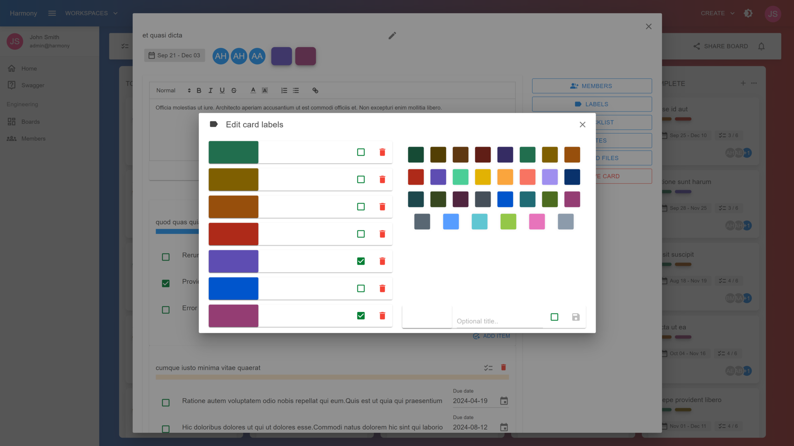

# 🏷 Add labels

Labels can be meaningful for your cards. You can add more that one labels to a card.

By default 7 labels will be created for each board. You can edit these labels by setting a custom title or delete them. Last but not least, you can create new labels with custom colors.

Click the **LABELS** button inside a card's view.

<figure><figcaption>
Card labels (light theme)
</figcaption></figure>

### Assign a label

Simply check the checkbox next to the label you want to add to your card. The label will be applied automatically.

### Create a new label

On the right side of the modal, select a color, set an optional title for the label and optionally check the checkbox before clicking the save button. If the checkbox was checked then the label will be also applied to your card.
