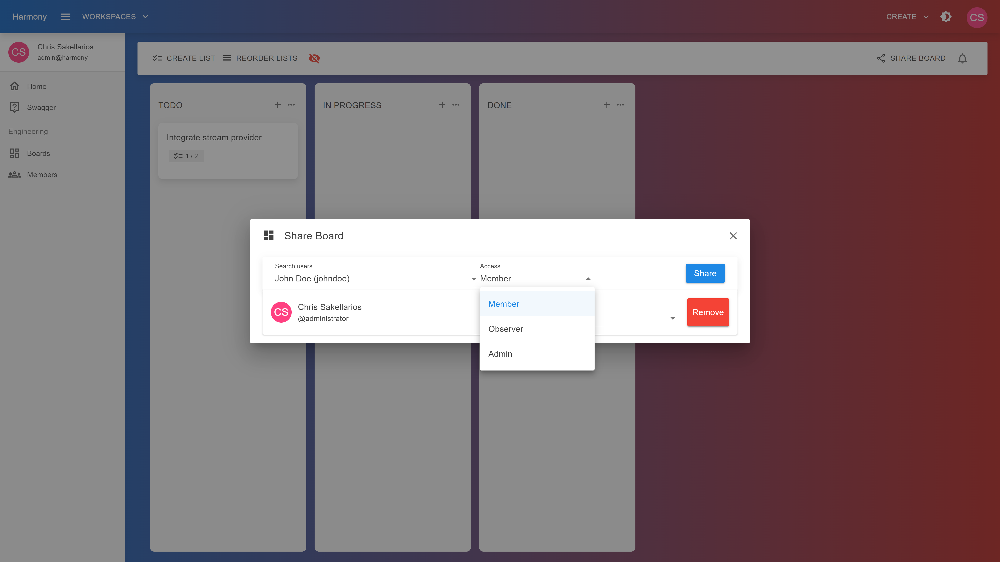

# 👥 Assign members

In the board's page click the **SHARE BOARD** button on the top bar. A modal will open where you can:

* Search for workspace users and add them to the board
* View board's members
* Change board members access level

<figure><figcaption>
Share board
</figcaption></figure>
