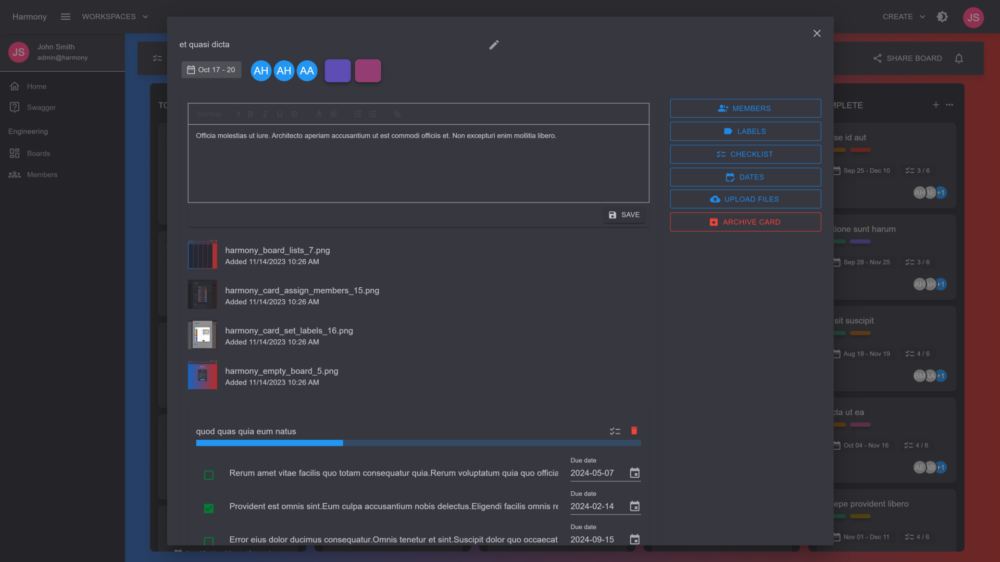

# 🗃 Attachments

Cards may contain image or file attachments to it. In the card's view you can upload files using the **UPLOAD FILES** button on the right side bar.

<figure><figcaption>
Card attachments
</figcaption></figure>


* If an attachment is an **image**, then clicking on it will open an image viewer.
* If an attachment is a **file**, then clicking on it will open the file for download on a new tab

