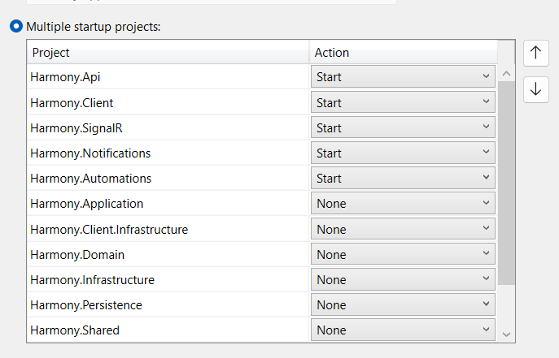

# 🏃‍♂️ Before running

### Running the apps through Visual Studio

In case you want to run or debug <mark style="color:blue;">**Harmony**</mark> from Visual Studio, add all the web application projects to the **startup projects** list by right clicking the solution and selecting **Configure Startup Projects..**

<figure><figcaption></figcaption></figure>

Set the Action to Start for the following projects:

* [x] Harmony.ApiGateway
* [x] Harmony.Api
* [x] Harmony.SignalR
* [x] Harmony.Client
* [x] Harmony.Automations
* [x] Harmony.Notifications
* [x] Harmony.Integrations.SourceControl

Before starting Harmony, complete all the following required steps:

### Required steps before running Harmony

* [x] For local development, you have installed all the required software and configured the connection strings as described in the [installations.md](dependencies/installations.md "mention")guide.
* [x] You have an SQL Server instance and you have configured **HarmonyConnection** connection string in <mark style="color:blue;">Harmony.Api</mark> and **HarmonyJobsConnection** connection string in <mark style="color:blue;">Harmony.Notifications</mark> & <mark style="color:blue;">Harmony.Automations</mark> respectively. Migrations can be run either manually or let the projects create the databases on start.
* [x] You have a **MongoDB Server** instance running and you have configured the MongoDB:ConnectionUI property in the **appsettings.json** for <mark style="color:blue;">Harmony.Automations</mark> project.
* [x] You have configured the **gRPC** communication between the microservices as described in the [gRPC](dependencies/grpc.md) section.
* [x] You have a RabbitMQ instance running and you have configured the **BrokerConfiguration** setting in all required projects in their **appsettings.json** file.
* [x] **Optional**: You have a Redis instance up and running and you have configured the **RedisConnectionString** property in the <mark style="color:blue;">Harmony.SignalR</mark> project's appsettings.json file.&#x20;
* [x] **Important!** You have set the **gatewayUrl** property in the <mark style="color:blue;">**Harmony.Client**</mark> project's **www** folder, in the appsettings.json file, equal to <mark style="color:blue;">Harmony.ApiGateway</mark> host URL
* [x] You have set the _AppEndpointConfiguration:FrontendUrl_ in Harmony.Api. This will be used for email templates in order to configure any links to the front.


[docker](docker/)



[workspaces](../guide/workspaces/)

