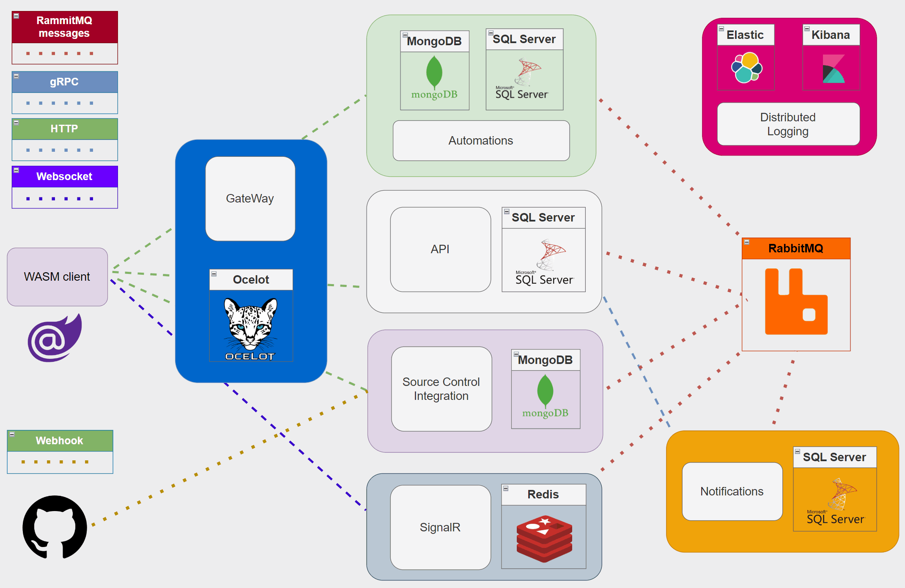

# ⚙️ Dependencies

Harmony at its core is a web application built with **.NET 8.0** which means it's a cross platform app and can be deployed anywhere _(Windows, Linux, Mac)_. On the other hand, it can be seen as a large scalable system consisting by several .NET Core applications and other components, each one having a specific responsibility. Because of this, it's highly advised that you have understood its architecture and carefully follow and configure one by one the required dependencies before running Harmony.

<figure><figcaption></figcaption></figure>

#### Architecture explained

* **Harmony.Client** is the standalone Blazor WASM application. It communicates via HTTP with the <mark style="color:blue;">Harmony.Api</mark> & <mark style="color:blue;">Harmony.Automations</mark> & connects via Websocket to <mark style="color:blue;">Harmony.SignalR</mark> to receive instant updates. All communication is pass through the Ocelot API Gateway.
* **Harmony.Api** is the core API for managing domain entities. It's the only application accessing harmony database and exposes gRPC services for other microservices.
* **Harmony.SignalR** is the web app which is responsible to push instant updates via WebSocket. Messages can be sent from any application via RabbitMQ. SignalR scaling is supported via Redis Backplane and it's optional.
* **Harmony.Integrations.SourceControl** is the web app that accepts Webhooks requests from source control providers. [github.md](../../integrations/github.md "mention") integration is already supported & others will follow next, e.g. GitLab
* **SQL Serve**r stores the required domain entities (workspaces, boards, cards, users).
* Automations are stored in a MongoDB database. Only the **Harmony.Automations** application has direct access to the MongoDB database. It provides gRPC services and runs automations upon message received via a RabbitMQ message.
* **Harmony.Notifications** is responsible for sending email notifications to users & optionally sending indexing requests to an integrated search service _(if any)_.
* **Harmony.ApiGateway** is the gateway used by Harmony.Client to access Harmony.Api, Harmony.Automations or Harmony.Integrations.SourceControl via HTTP and Harmony.SignalR via Websocket. The client uses the gateway's endpoint which is responsible to pass through the requests (HTTP or WebSocket) to internal microservices.
* Elasticsearch & Kibana are used for distributed logging. Available using docker or/and Kubernetes


Configure one by one the following components - Each link provides details about the role of the corresponding component and how to configure it. After finishing with the component's setup, follow with the individual web app configurations _(e.g. appsettings.json)_

\
Maybe you want to fast-forward? :man\_running: That's ok, you can fire up the entire infrastructure via [docker](../docker/) commands!


Harmony dependencies are:

* **Databases**: Harmony uses SQL Server, MongoDB & and Redis by individual apps. Before configuring read the [databases](databases/ "mention") guide to understand the purpose of each database provider.
* An **SQL Server** & and a **MongoDB Server** which can be installed on Windows or [Linux](https://learn.microsoft.com/en-us/sql/linux/sql-server-linux-setup?view=sql-server-ver16#supportedplatforms).  Read the [sql-server.md](databases/sql-server.md "mention")and [mongodb-server.md](databases/mongodb-server.md "mention")to setup the required database providers.
* A **Redis** instance: Redis backplane is used for scaling **Harmony.SignalR** application. Read the [redis.md](databases/redis.md "mention") section to setup Redis and Harmony.SignalR project's configuration.
* A **RabbitMQ** instance for asynchronously  exchanging messages between Harmony's components. Read the [rabbitmq.md](rabbitmq.md "mention") section to setup RabbitMQ.
* Email service provider: Harmony needs you to configure an email service provider so that it can send the email notifications. Currently Gmail & [Brevo](https://www.brevo.com/products/transactional-email/) are supported but it's very easy to add your own provider. Read the  [email-provider.md](email-provider.md "mention") guide for more information about how to setup an email provider.
* Search engine (optional): Harmony provides a powerful search engine functionality that can be configured either via direct database search or using a 1st class indexing service named [Algolia ](https://www.algolia.com/products/ai-search/)_(it's free by the way for 10000 req/month)_.. Read the [search](search-engine.md) section for more details.
* **Harmony.Notifications**: A web application that subscribes to RabbitMQ messages and handles email and search index notifications.
* **Harmony.ApiGateway**: The API Gateway based on [Ocelot](https://github.com/ThreeMammals/Ocelot) to provide a **unified point** of entry to Harmony services.


Don't get overwhelmed by the number of things you need to setup before firing up Harmony. Keep in mind the followings:

1. Database migrations & seeding can run automatically during startup which means you don't have to manually run them.
2. &#x20;RabbitMQ exchanges/queues are being created for you.&#x20;

This means that if you want to start Harmony from Visual Studio, the only thing required is to install the required infrastructure on your machine, SQL Server, MongoDB, RabbitMQ, Redis _(optional for localhost)_, place the correct connection strings  & just setup the [startup projects](../before-running.md) on Visual Studio.

Also you need to configure the correct **AppEndpointConfiguration** settings in all application.settings.json files.\




[databases](databases/)



[rabbitmq.md](rabbitmq.md)



[search-engine.md](search-engine.md)



[email-provider.md](email-provider.md)



[deployment.md](../deployment.md)


#### Make Harmony yours - Buy once, get updates for ever :rocket:


[Broken link](broken-reference)

