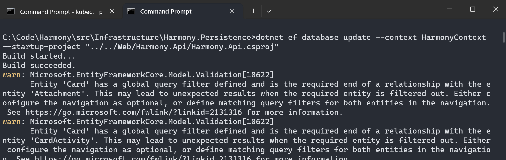

# PostgreSQL


PostgreSQL is optional and can be replaced by **SQL Server** instead. By default the repository is configured to run using SQL Server. In case you want to use SQL Server read [sql-server.md](sql-server.md "mention")


Harmony has an dependency to **PostgreSQL** databases which can be installed on Windows or [Linux](https://learn.microsoft.com/en-us/sql/linux/sql-server-linux-setup?view=sql-server-ver16#supportedplatforms). After installing an PostgreSQL instance, proceed by creating the required databases and configuring the connection strings for the following three databases:

1. **Harmony**: The core database used by the <mark style="color:blue;">Harmony.Api</mark> server app, containing all the core tables and their relationships, e.g. Workspaces, Boards or Cards.
2. **Harmony.Notifications.Jobs**: The database used by the <mark style="color:blue;">Harmony.Notifications</mark> web app, containing all the HangFire required tables and one more.
3. **Harmony.Automations.Jobs**: The database used by the <mark style="color:blue;">Harmony.Automations</mark> web app, containing all the HangFire required tables and one more.

### Harmony database configuration

#### Database connection string

Configure the <mark style="color:orange;">HarmonyConnection</mark> SQL Server's connection string existing in the <mark style="color:blue;">**appsettings.json**</mark> file at the root of the **Harmony.Api** project to point to your SQL Server instance. By default it tries to connect to a local PostgreSQL instance. Change the connection string to match your environment.

```json
  "DatabaseProvider": "PostgreSQL",
  "ConnectionStrings": { 
     "HarmonyConnection": "Host=localhost;Database=Harmony;Username=postgres;Password=MySecretPassword"
  }
```

#### Database migrations


Since Harmony can be run either using **SQL Server** or **PostgreSQL**, there are two separate class library projects for the respective migrations:

* Harmony.Persistence.Migrations.SqlServer
* Harmony.Persistence.Migrations.PostgreSql

In case you want to contribute and you want to add a new migration, you need to create the migration for both database providers. There are detailed instructions on how to apply or add migrations for each provider in the respective guides.


You can run the database migrations either manually or **let the projects run them for you** during startup.

#### Run migrations through <mark style="color:blue;">Visual Studio</mark>

When running migrations through Visual Studio, open the `Package Manager Console` and set the `Default project` to **src\Infrastructure\Harmony.Persistence**. This should be the default project when running other migrations as well _(NotificationContext & AutomationContext examples following)_

Run the following command to create the database:

```powershell
Update-Database -Context HarmonyContext -StartUpProject Harmony.Api
```

<figure><figcaption><p>Run update migration for Harmony database</p></figcaption></figure>


Migrations command require that you have previously setup your database connection strings properly.


In case you decide to **create** a new migration, follow the same procedure by replacing the command with the following:

```powershell
Add-Migration MyCustomMigrationName -OutputDir HarmonyContextMigrations -Context HarmonyContext -Project Harmony.Persistence.Migrations.SqlServer -StartUpProject Harmony.Api
```

#### Run migrations using a command line

You can run database migrations from a command line as well. First you need to have installed [EF Core tools](https://learn.microsoft.com/en-us/ef/core/cli/dotnet).

```powershell
dotnet tool install --global dotnet-ef
```


In case you had previously installed a **dotnet-ef** version other than the latest, update it by running the following command:\
\
`dotnet tool install --global dotnet-ef`


1. Open a terminal and navigate at the root of the **Harmony.Persistence** project, where the <mark style="color:blue;">HarmonyContext</mark> database context class exists.
2. Run the **dotnet ef** command to create the database

```powershell
dotnet ef database update --context HarmonyContext --startup-project "../../Services/Harmony.Api/Harmony.Api.csproj" -- --DatabaseProvider SqlServer
```


In case you have installed a local SQL Server on a **Linux** machine accepting a Developer license, you need to add **Encrypt=False;** at the end of your connection string before running migration commands, otherwise you will get an error. Also keep in mind that for Linux SQL Server installations your connection string should use username and password rather than windows authentication.\
\
Harmony has been tested successfully :white\_check\_mark: on **Windows** and an **Ubuntu 22.04** machine. SQL Server for Ubuntu was installed following [this](https://learn.microsoft.com/en-us/sql/linux/quickstart-install-connect-ubuntu?view=sql-server-ver16\&tabs=ubuntu2204) guide.


<figure><figcaption><p>Create database migration through command line</p></figcaption></figure>


Just a reminder here: It's **optional** to run the migrations by yourself because they run by default at startup in **debug** mode.


To disable the automatic migrations remove the following line from the <mark style="color:blue;">ApplicationBuilderExtensions</mark> class.

```csharp
harmonyContext.Database.Migrate();
```

### Harmony.Notifications & Harmony.Automations jobs database configuration

#### Database connection string

Configure the SQL Server's _HarmonyJobsConnection_ connection strings existing in the <mark style="color:blue;">**appsettings.json**</mark> file at the root of the **Harmony.Notifications** & **Harmony.Automations** projects to point to your SQL Server instance.

#### Harmony.Notifications appsettings.json

```json
  "DatabaseProvider": "SqlServer",
  "ConnectionStrings": {
    "HarmonyJobsConnection": "Server=.;Database=Harmony.Notifications.Jobs;Integrated Security=True;TrustServerCertificate=True"
  },
```

#### Harmony.Automations appsettings.json

```json
  "DatabaseProvider": "SqlServer",
  "ConnectionStrings": {
    "HarmonyJobsConnection": "Server=.;Database=Harmony.Automations.Jobs;Integrated Security=True;TrustServerCertificate=True"
  },
```

#### Database migrations

Use the same process & commands you used for Harmony database and Harmony.Api projects except that you have to change the following two parameters:

* \-**Context**: NotificationContext or AutomationContext
* \-**StartUpProject**: Harmony.Notifications or Harmony.Automations&#x20;

**Applying migrations via dotnet-ef tools:**

```powershell
dotnet ef database update --context NotificationContext --startup-project "../../Services/Harmony.Notifications/Harmony.Notifications.csproj" -- --DatabaseProvider SqlServer
```

```powershell
dotnet ef database update --context AutomationContext --startup-project "../../Services/Harmony.Automations/Harmony.Automations.csproj" -- --DatabaseProvider SqlServer
```

**Applying migrations using Visual Studio package manager console:**

```powershell
Update-Database -Context NotificationContext -StartUpProject Harmony.Notifications
```

```powershell
Update-Database -Context AutomationContext -StartUpProject Harmony.Automations
```

#### Read next - configure the MongoDB Server
