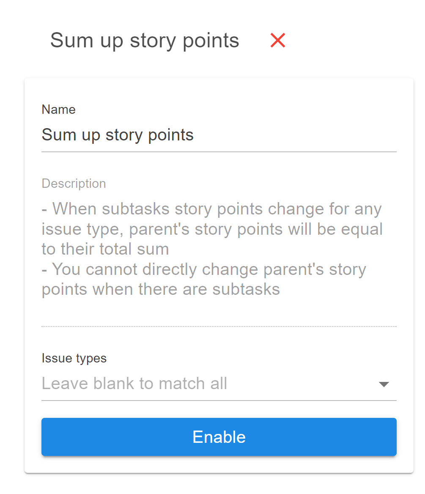

# Sum up story points

The <mark style="color:orange;">Sum up story points</mark> automation can be used to update the parent issue story points by calculating the total sum of story points existing on the sub tasks.

Navigate to the <mark style="color:blue;">Settings => Automation</mark> view of your board and select to **Configure** the <mark style="color:orange;">Sum up story points</mark> automation. A drawer will open where you can configure the following options:

* **Name**: Give a descriptive name for your automation. Currently you may create only one rule for this automation.
* **Description**: This is a disabled field, automatically filled for you in order to help you understand how the automation behaves.
* **Issue types**: Select the issue types that the automation will apply for. For example, if you select on the _Story_ type, then the automation will only run for issues of type _Story_. All other issue types won't be affected. Leave the _issue types_ empty and the automation will run for all issue types.

<figure><figcaption>
Sum up story points configuration
</figcaption></figure>


In case you try to directly update the story points for a parent issue while the automation is active, you will get an error message saying that story points are being calculated from subtasks.

