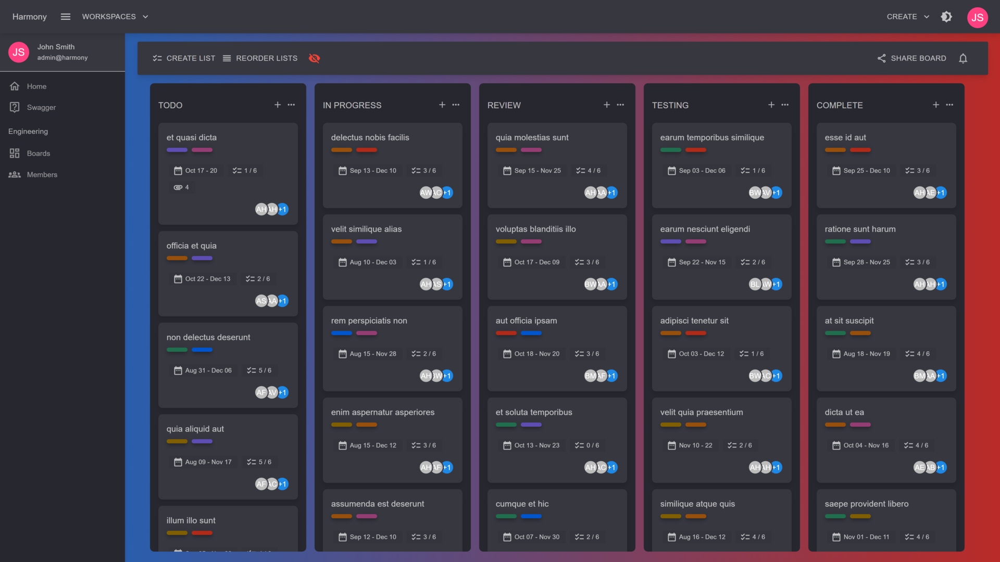

# Boards

Boards are containers for your cards. The are a snapshot of your current project's status displaying each card's status based on the list it belongs to.


Cards display important information on a boards view, such as the members assigned to them, number of attachments, labels, due date and total progress of a card based on the number of items completed per total items required


<figure><figcaption>
Board cards (dark theme)
</figcaption></figure>

#### Read next - Create boards


[create.md](create.md)

