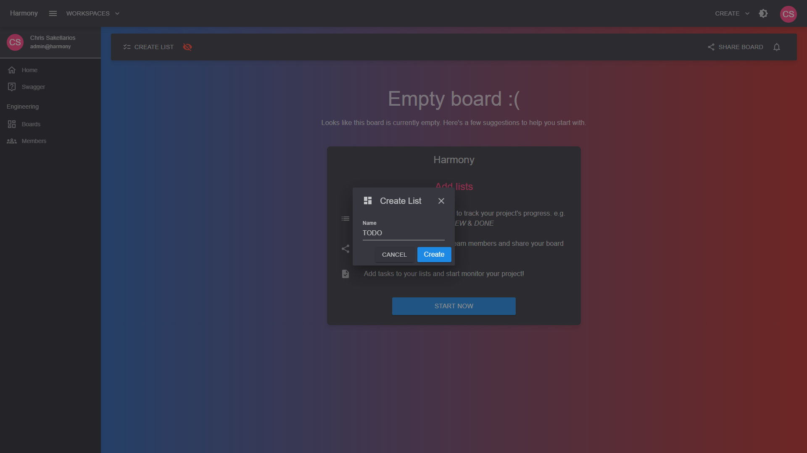
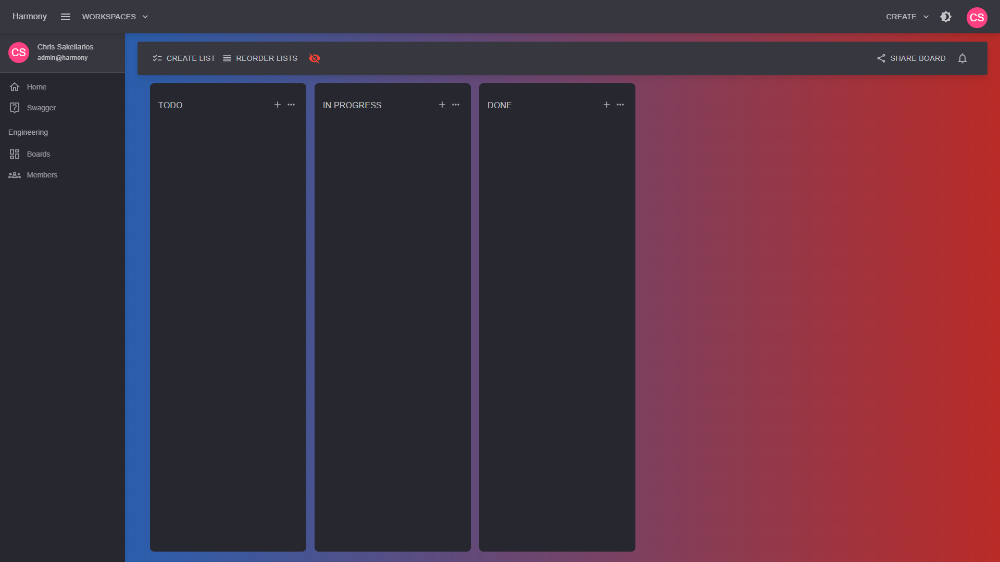
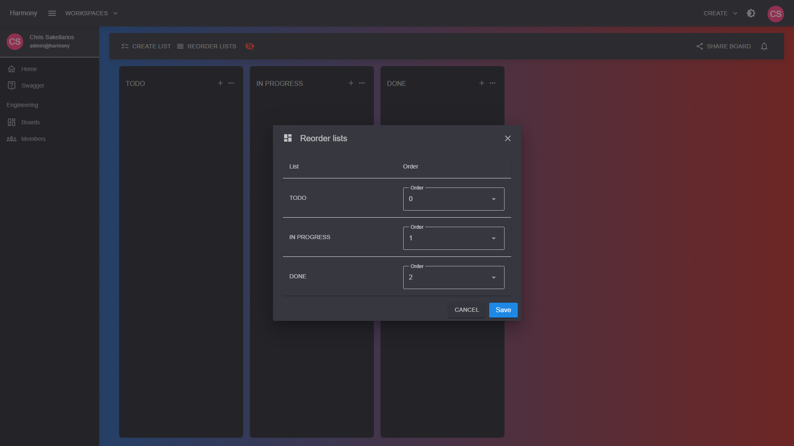
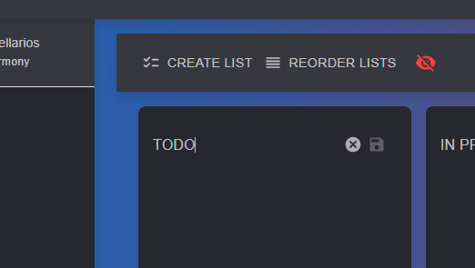

# 📊 Board lists

### Create board list

In the boards page click **CREATE LIST** from the top bar. Give a descriptive title to your list and click **Create**.

<figure><figcaption>
Create list modal
</figcaption></figure>

Here is an example with 3 lists

<figure><figcaption>
Sample board lists
</figcaption></figure>

### Reorder board lists

You can always reorder your lists by clicking the **REORDER LISTS** from the top bar.

<figure><figcaption>
Reorder lists
</figcaption></figure>

### Rename a board list

Click on a board list's title and the text will automatically change to input. Make the change you want and click enter or the save button.

<figure><figcaption>
Rename a board list
</figcaption></figure>
