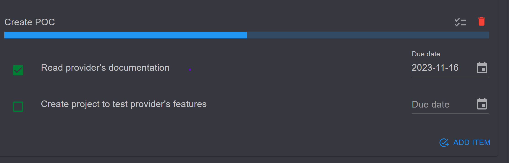

# ✅ Check lists

### Add a checklist

Inside the card's view click **CHECKLISTS** from the right menu. Enter a title and press enter or click the **Create** button.

<figure><figcaption>
Create check list (dark theme)
</figcaption></figure>

### Add a check list item

Click **ADD ITEM** at the bottom of a list and add as many items as you want. You can optionally set a due date.

<figure><figcaption>
Add item
</figcaption></figure>

<figure><figcaption>
Set description and due date to an item
</figcaption></figure>


Each list has progress to display the total status of its items.


<figure><figcaption></figcaption></figure>


* Edit a list's title by clicking on the title
* Delete a check list by clicking the bin icon


<figure><figcaption>
Card's checklists / checklist items
</figcaption></figure>

#### Read next - assign card members


[assign-members.md](assign-members.md)

