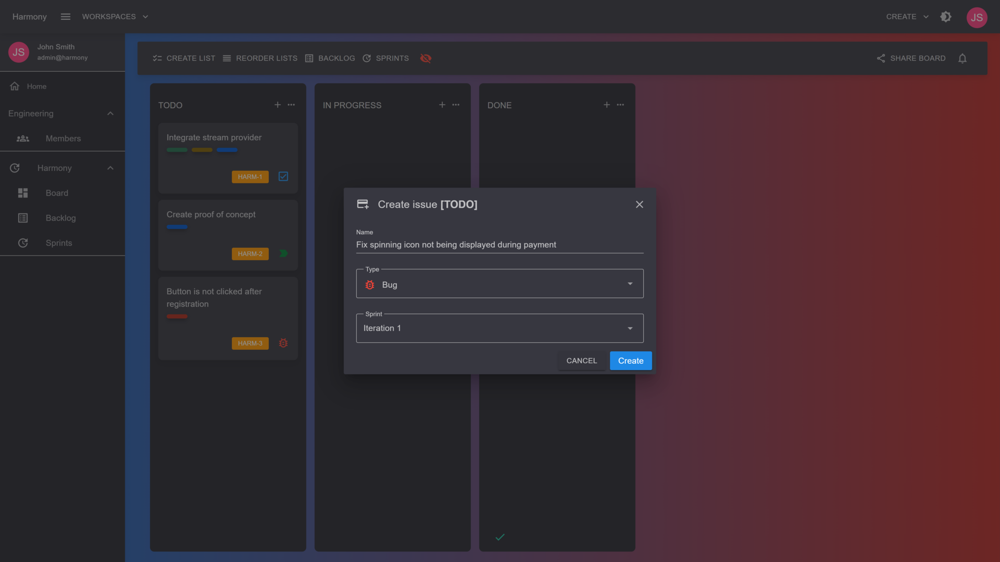

# ➕ Create

Click the :heavy\_plus\_sign:button right next to a list's title. Enter the card's title and click save or press enter.&#x20;


For scrum projects, the :heavy\_plus\_sign:icon will be **disabled** if there's no active sprint. Make sure to start a sprint first. When you do this you will also able to select the sprint to add the card / issue to.


<figure><figcaption>
Create issue
</figcaption></figure>

#### Read next - View card


[view.md](view.md)

