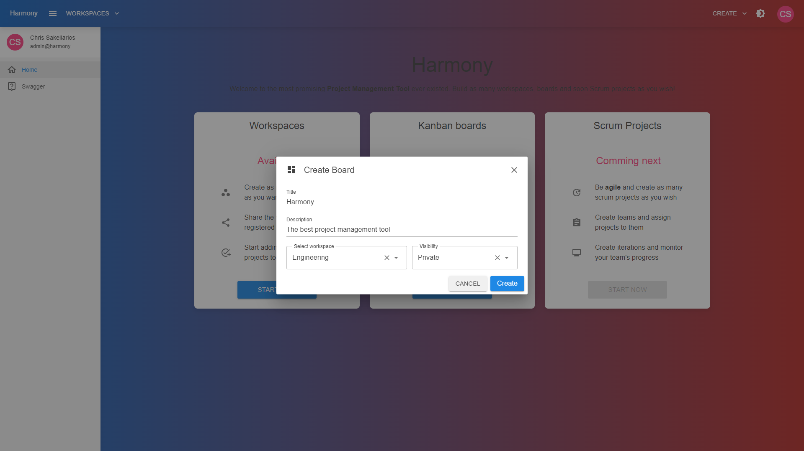

# ➕ Create

You can create a Kanban board by clicking the upper right drop menu and selecting **Create Kanban Board**.

<figure><figcaption></figcaption></figure>

Next, fill the new board's details and click **Create**. A board must always belong to a workspace.

<figure><figcaption></figcaption></figure>
