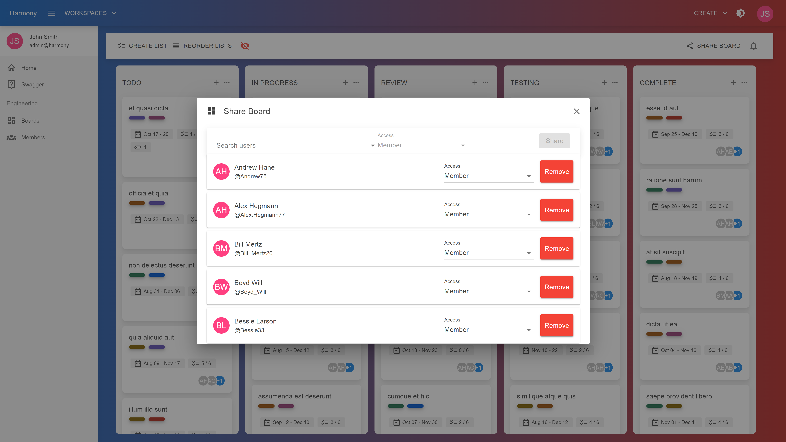
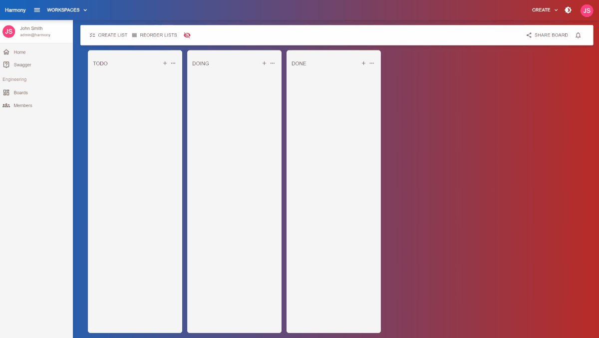

# 👥 Members

Inside a board's view click the **SHARE BOARD** button on right side of the the top bar. The modal will display the current board's members and you will be able to search for users to add more.

<figure><figcaption>
Share board
</figcaption></figure>

<figure><figcaption>
Board members
</figcaption></figure>

#### Read next - Cards


[cards](../cards/)

