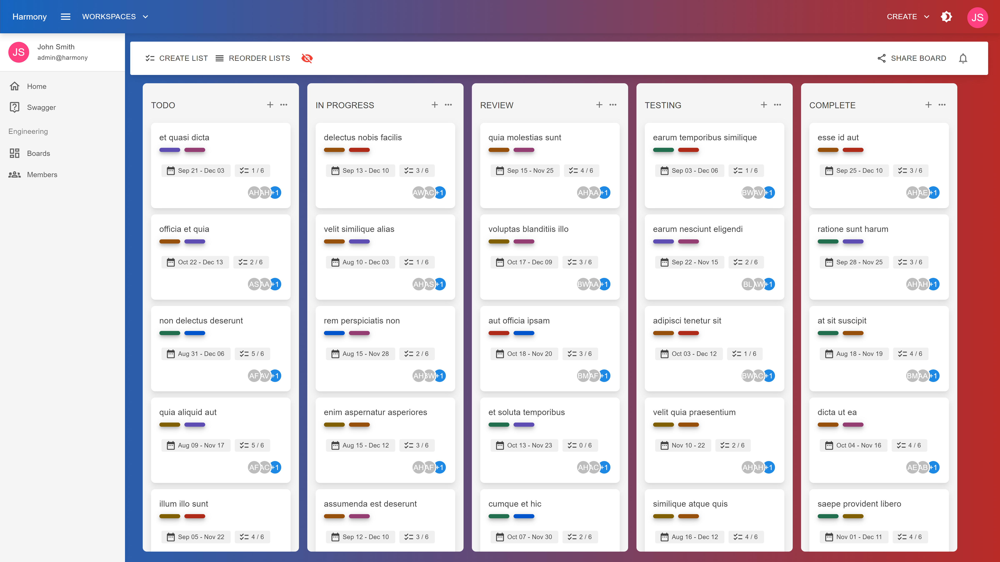

# Cards

Cards are the essence of a board, describing:

* What should be done
* When should be done
* Who should do a particular task
* The current status of task based on the list the card belongs to

<figure><figcaption>
Board cards (light theme)
</figcaption></figure>

#### Read next - Create cards


[create.md](create.md)

