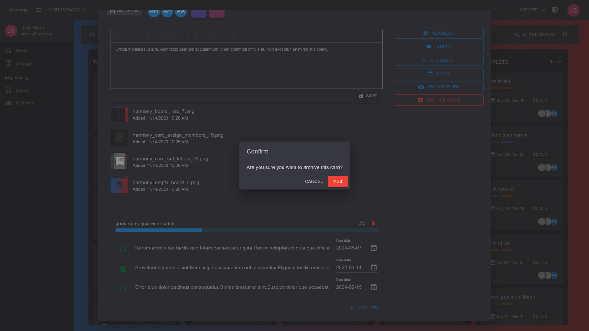
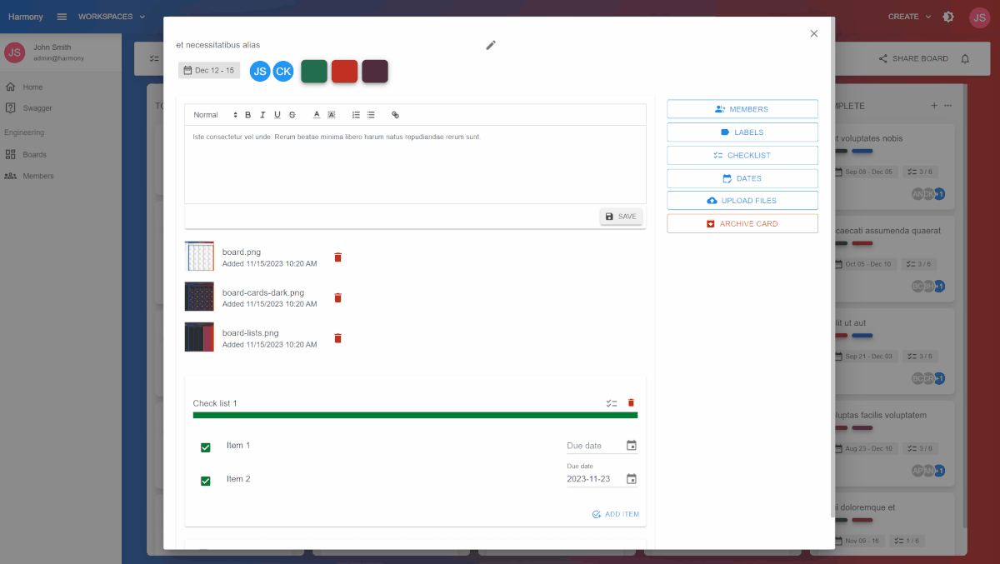

# 🔴 Archive

You can archive a card by clicking the **ARCHIVE CARD** button on the right side of a card's view.

Click **YES** to the confirmation box to archive the card.

<figure><figcaption>
Archive a card
</figcaption></figure>

<figure><figcaption>
Archive card
</figcaption></figure>
