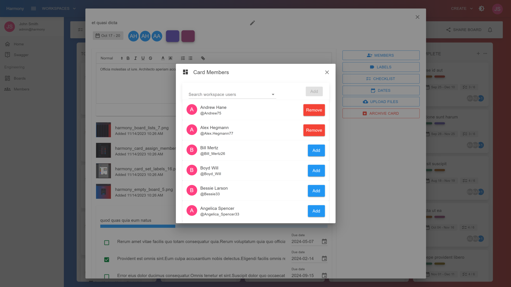
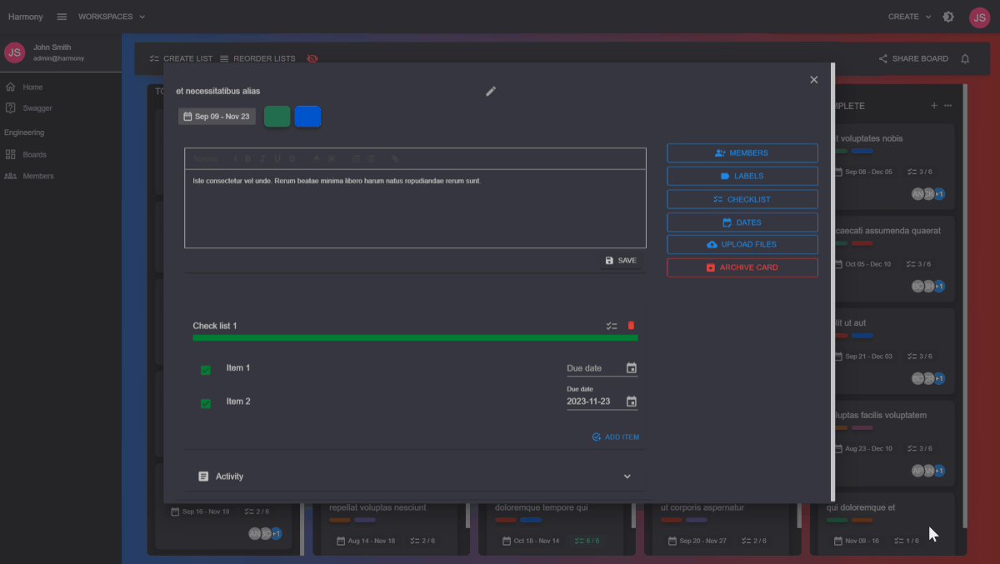

# 👥 Assign members

In the card's view click the **MEMBERS** button from the right side bar. A modal will open where you can:

* Search for workspace users and assign them to the card. This will add them to the workspace/board as well in case they aren't already
* View card's members
* Add or remove members from the card
* By default, all board member's will loaded

<figure><figcaption>
Card's members
</figcaption></figure>

<figure><figcaption>
Card's members
</figcaption></figure>

#### Read next - Add card labels


[add-labels.md](add-labels.md)

