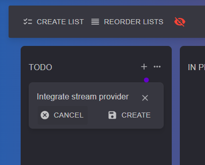

# ➕ Create

Click the :heavy\_plus\_sign:button right next to a list's title. Enter the card's title and click save or press enter.

<figure><figcaption></figcaption></figure>

#### Read next - View card


[view.md](view.md)

