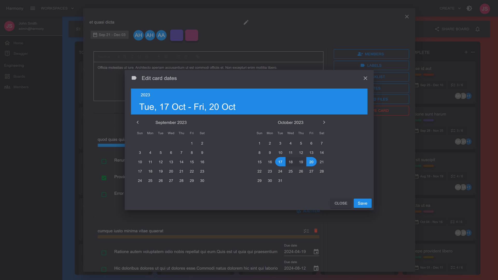

# 📅 Set dates

Your cards may have a **start** and a **due** date. Click the DATES button on the right side of a card's view to open the date picker.

<figure><figcaption>
Card dates
</figcaption></figure>


Clicking two different days will assign both a start and a due date. If the start and due date are the same, only the due date will be assigned.\
\
Dates are assigned after clicking the **Save** button.


#### Read next - Add card attachments


[attachments.md](attachments.md)

