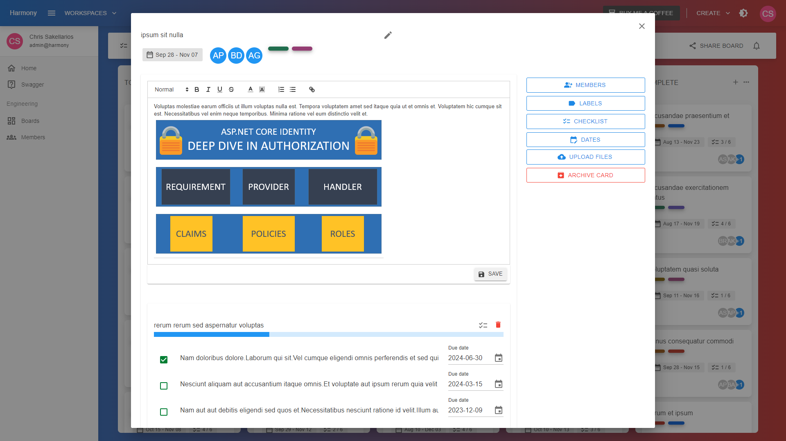
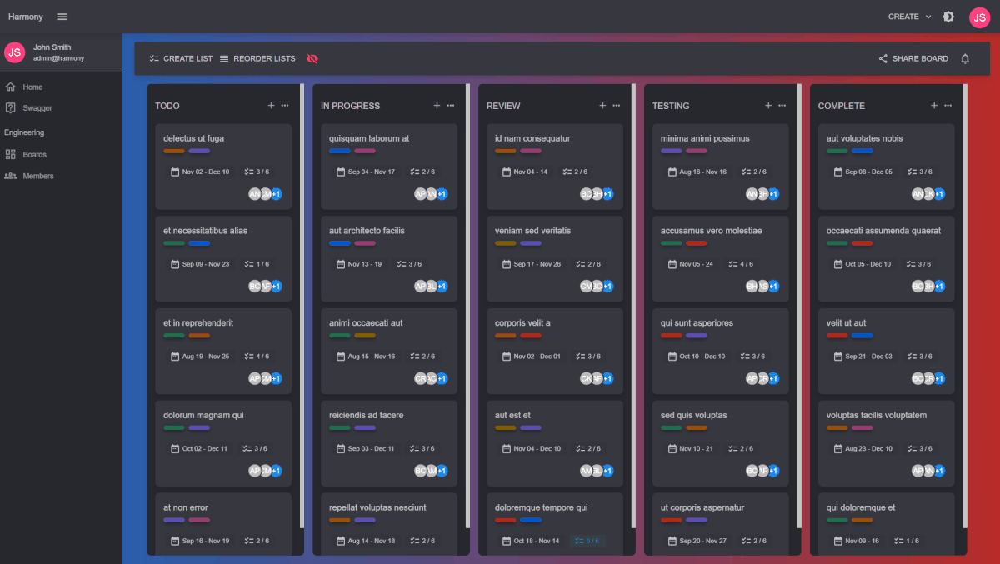

# 👁 View

You can view/open a card by simply clicking on it

<figure><figcaption>
Card's view (light theme)
</figcaption></figure>

Here you can edit card's features like assigning members, adding labels, creating check lists with check list items, setting due dates and upload attachments.

### Edit card's title

Inside the card's view, just click on the card's title and enter the new title.

### Edit card's description

The card's view contains an integrated text editor where you can add custom html using its buttons. The editor also supports copying an image from the web and pasting inside.

<figure><figcaption>
Card's view
</figcaption></figure>

#### Read next - Add check lists


[check-lists.md](check-lists.md)

