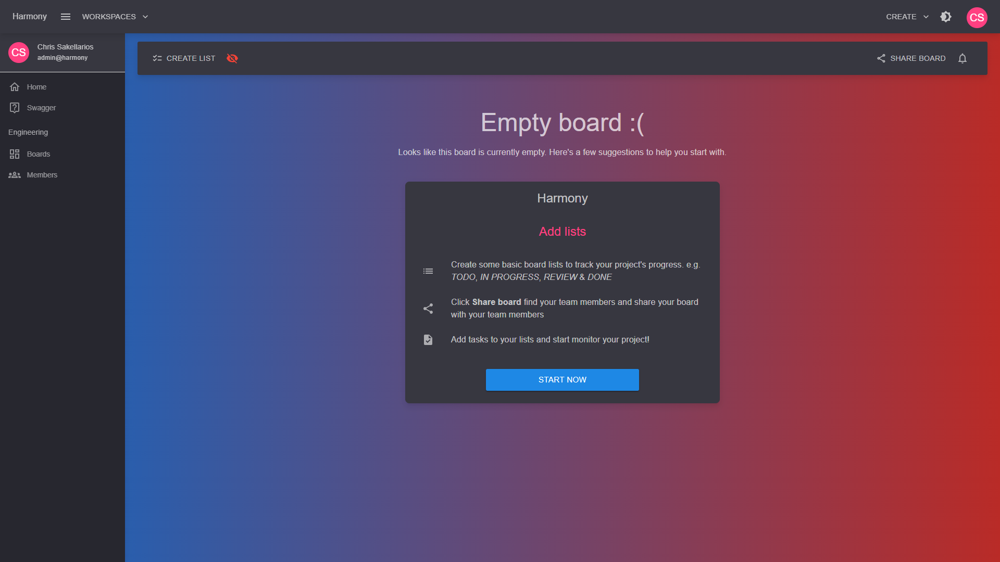

# Kanban

You can create a Kanban board by clicking the upper right drop menu and selecting **Create Kanban Board**.

<figure><figcaption>
Create Kanban board
</figcaption></figure>

<figure><figcaption></figcaption></figure>

After creating a Kanban board, you will be able to add lists to it. An empty board looks like this.

<figure><figcaption></figcaption></figure>

Continue by adding board lists to your board. You can find everything available in the **Boards** section of the documentation.

#### Read next - Continue with Kanban or check the Scrum projects


[board-lists.md](boards/board-lists.md)



[scrum](scrum/)

