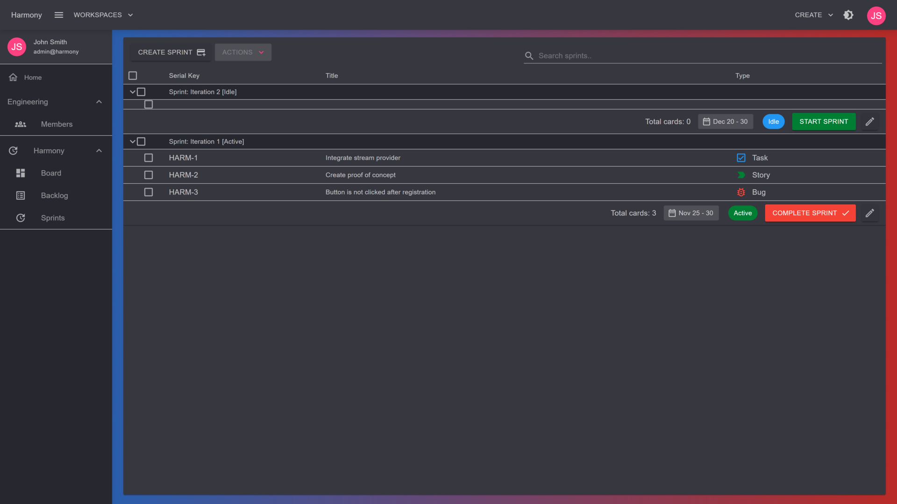

# Scrum

Scrum projects are Kanban boards on steroids :muscle:. It is recommended for large, complex projects that need to be broken down into bite-sized pieces of value.

In Harmony you can plan upcoming work in a **backlog** and organize cycles of work into **sprints**. After creating a scrum project you can:

* [x] Build and plan your backlog
* [x] Create sprints
* [x] Move issues from backlog to sprints
* [x] Move issues from sprints back to backlog
* [x] **Start a sprint** - support for more than one active sprints
* [x] **Complete a sprint** and move pending items to either backlog, existing or a new sprint

<figure><figcaption>
Create backlog item
</figcaption></figure>

 

<figure><figcaption>
Move backlog to sprints
</figcaption></figure>

 

<figure><figcaption>
Sprints
</figcaption></figure>

#### Read next - Create a scrum project


[create.md](create.md)

