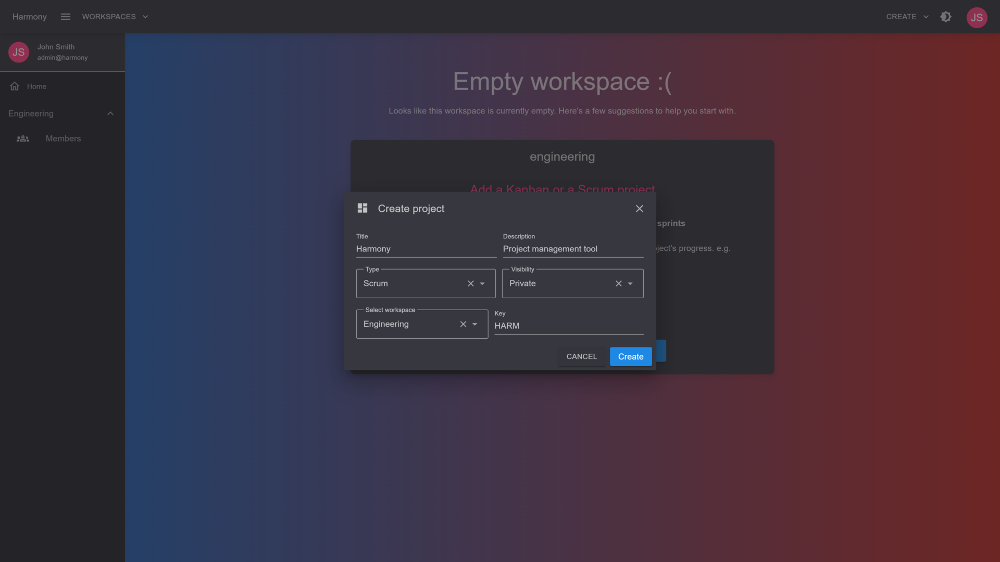

# ➕ Create

You can create a **Scrum** project by clicking the upper right drop menu and selecting **Create Scrum Project**.

<figure><figcaption>
Create project selection
</figcaption></figure>

<figure><figcaption>
Create scrum project
</figcaption></figure>
