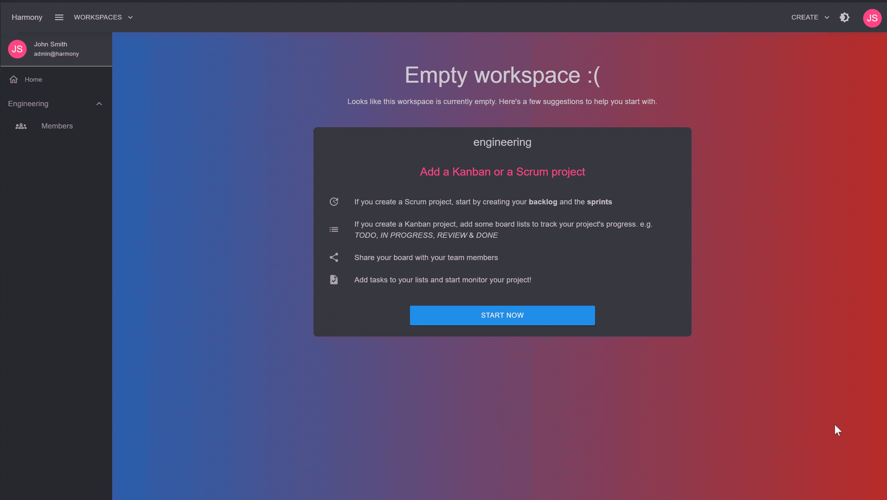

# ➕ Create

You can create a **Scrum** project by clicking the upper right drop menu and selecting **Create Scrum Project**.

<figure><figcaption>
Create scrum project
</figcaption></figure>


* When you create a Scrum project, 3 board lists are being created automatically for you: _**TODO**_, _**IN PROGRESS**_ & **DONE**.
* Every issue that reaches the DONE list is marked as **completed**. This is important to remember when you want to **complete** a sprint. Issues that aren't in the _Done_ list are considered pending and can be moved to an existing or a new sprint or in the backlog during sprint's completion.


#### Read next - Start planning by building your backlog


[backlog.md](backlog.md)

