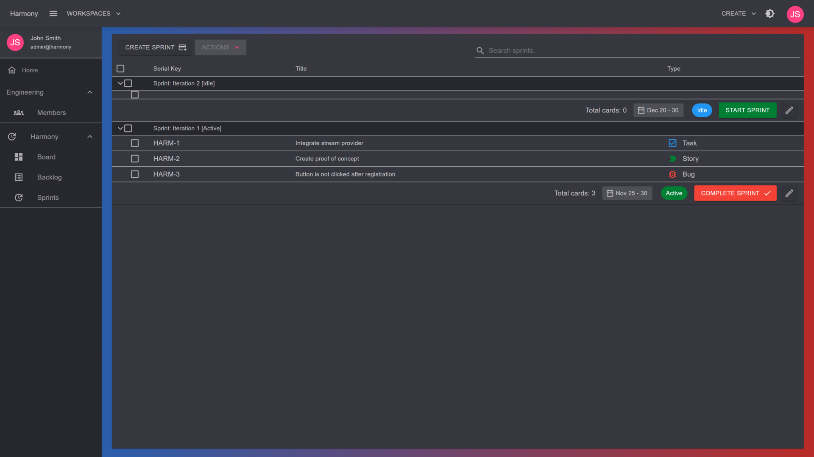
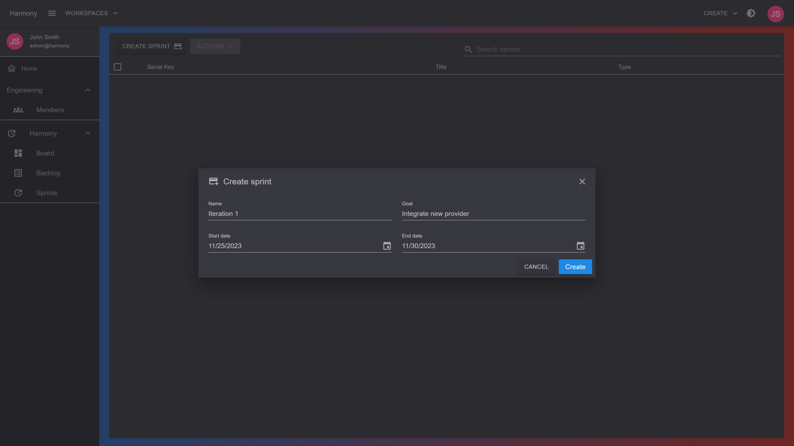
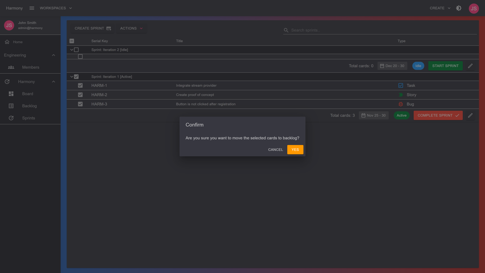

# 🎯 Sprints

Sprints are the core components of a scrum project's board. The board of a scrum project displays items that has been added to sprints which are in **Active** status.


You can have more than one sprint in **Active** status


<figure><figcaption>
Sprints
</figcaption></figure>

### Create a sprint

In the Sprints view of a scrum project, click the CREATE SPRINT button. Give a meaningful name for your sprint, an optional goal and a start/end date range. Click the **Create** button to add the sprint to your project.

<figure><figcaption>
Create new sprint
</figcaption></figure>

### Move issues to backlog

If for some reason you want to move some issues from a sprint to the backlog, you can do this by selecting the issues from the sprint, and click the **Move to backlog** from the **ACTIONS** menu.

<figure><figcaption>
Move to backlog
</figcaption></figure>


If the sprint that you moved the items from was Active, then the items will also not be visible anymore in the project's board

