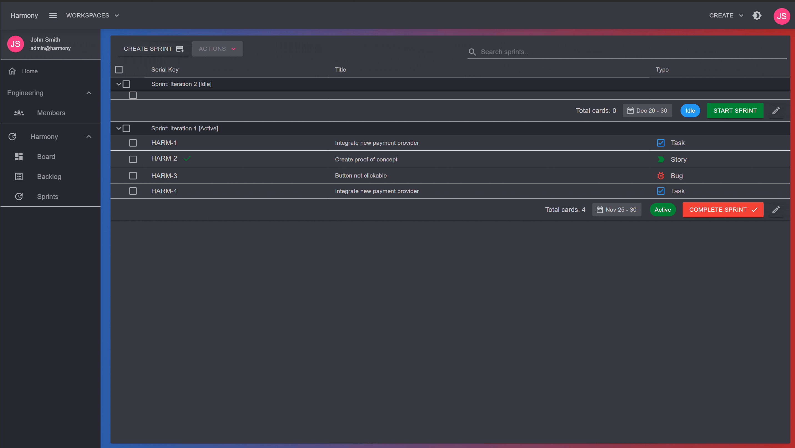

# 🎯 Sprints

Sprints are the core components of a scrum project's board. The board of a scrum project displays items that has been added to sprints which are in **Active** status.


You can have more than one sprint in **Active** status


<figure><figcaption>
Sprints
</figcaption></figure>

### Create a sprint

In the Sprints view of a scrum project, click the CREATE SPRINT button. Give a meaningful name for your sprint, an optional goal and a start/end date range. Click the **Create** button to add the sprint to your project.

<figure><figcaption>
Create new sprint
</figcaption></figure>

### Move issues to backlog

If for some reason you want to move some issues from a sprint to the backlog, you can do this by selecting the issues from the sprint, and click the **Move to backlog** from the **ACTIONS** menu.

<figure><figcaption>
Move to backlog
</figcaption></figure>


If the sprint that you moved the items from was Active, then the items will also not be visible anymore in the project's board


### Sprint Reports - Burndown chart

At any time during the sprint, click the **REPORTS** button to view the burndown chart. You can see the total story points committed to the sprint and the story points remained as well.&#x20;


A **burndown chart** shows the amount of work that has been completed in an epic or sprint, and the total work remaining.


<figure><figcaption>
Burndown chart
</figcaption></figure>


* If you notice that the team consistently finishes work early _(**pink** line will be under the <mark style="color:blue;">blue</mark> one)_, this might be a sign that they aren't committing to enough work during sprint planning.&#x20;
* If they consistently miss their forecast _(**pink** line above the <mark style="color:blue;">blue</mark> one and remaining story points > 0)_, this might be a sign that they've committed to too much work.


An overview of the sprint issue types worked on the sprint is also available by clicking the **ISSUES OVERVIEW** tab.

<figure><figcaption></figcaption></figure>

### Complete a sprint

When it's time to complete a sprint, open the **Sprints** view, find the sprint and click the **COMPLETE** button. There are three options for the pending sprint's issues:

1. Move them to an **existing sprint** - available sprints will be shown in the dropdown list.
2. Move them to the **backlog**.
3. Move them to a **new sprint**. The new sprint will be created automatically for you.

<figure><figcaption>
Complete a sprint
</figcaption></figure>


* You can always edit a sprint's name and date range by clicking the edit icon in the sprints view
* Issues with **Done** status won't be moved


