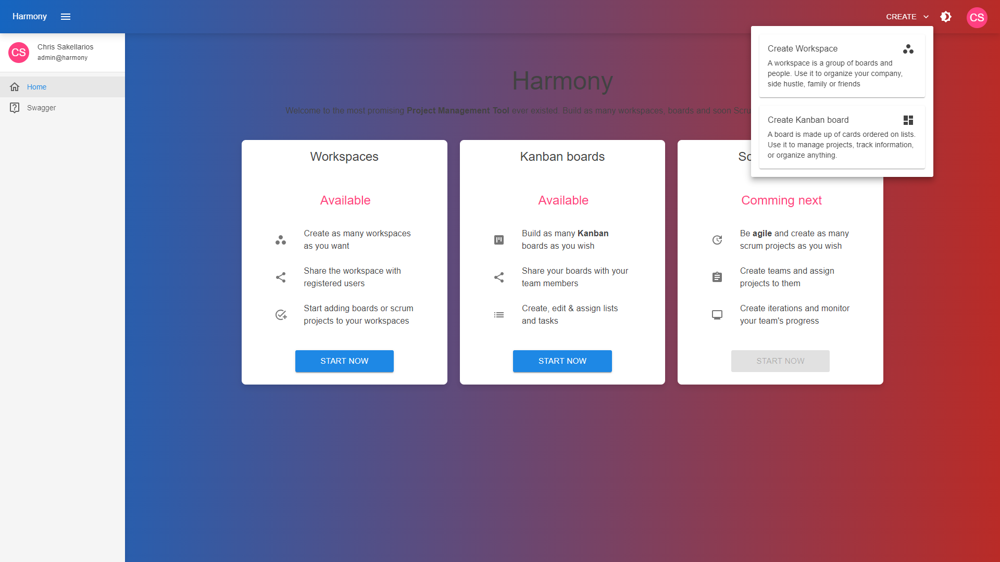
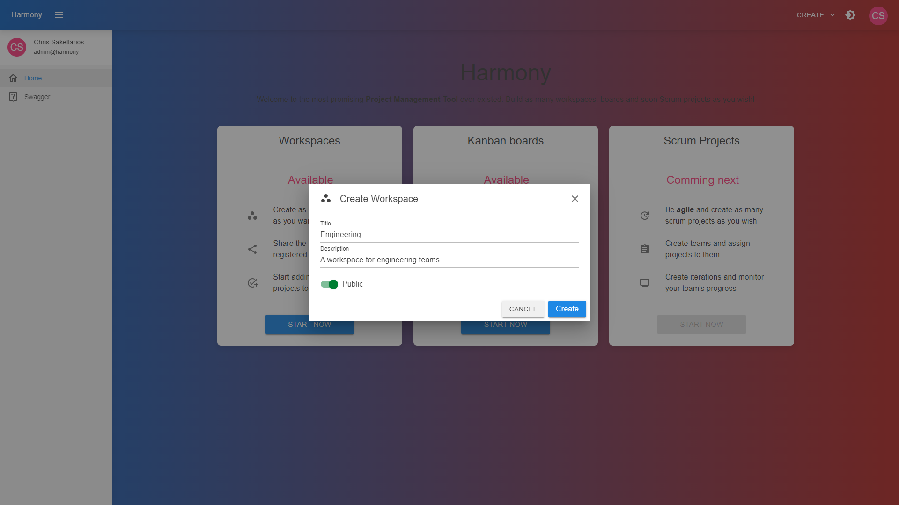

# ➕ Create

You can create a workspace by clicking the upper right drop menu and selecting **Create Workspace**.

<figure><figcaption>
Create workspace menu
</figcaption></figure>

Next, fill the new workspace's details and click **Create**.

<figure><figcaption></figcaption></figure>
