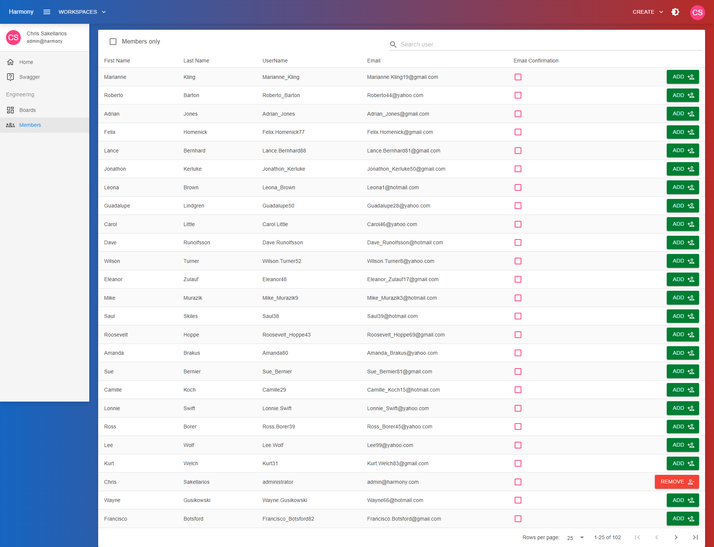
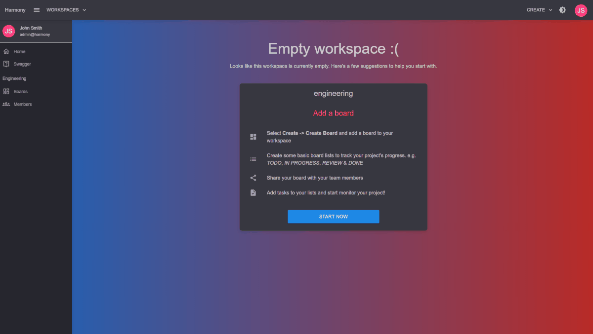

# 👥 Members

Click **Members** from the left side menu to search and add/remove members to/from a workspace.

<figure><figcaption>
Workspace members
</figcaption></figure>

<figure><figcaption>
Adding a workspace member
</figcaption></figure>


You need to be a workspace **admin** to add or remove members to/from a workspace



You can check/uncheck the Members only checkbox to filter the search results respectively.


### Read next - Kanban or Scrum projects


[kanban.md](../kanban.md)



[scrum](../scrum/)

