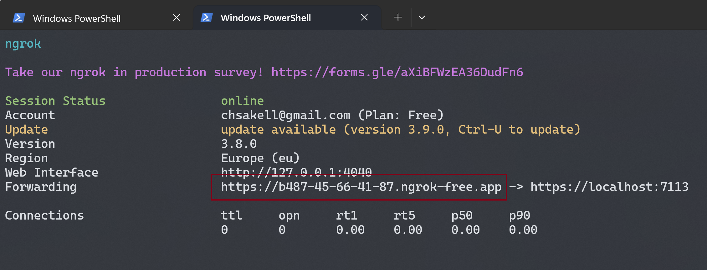
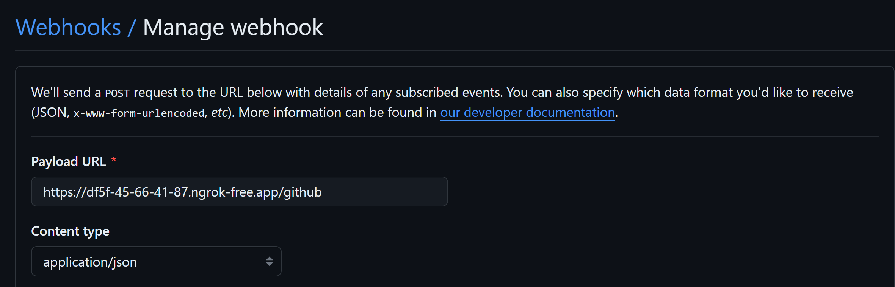
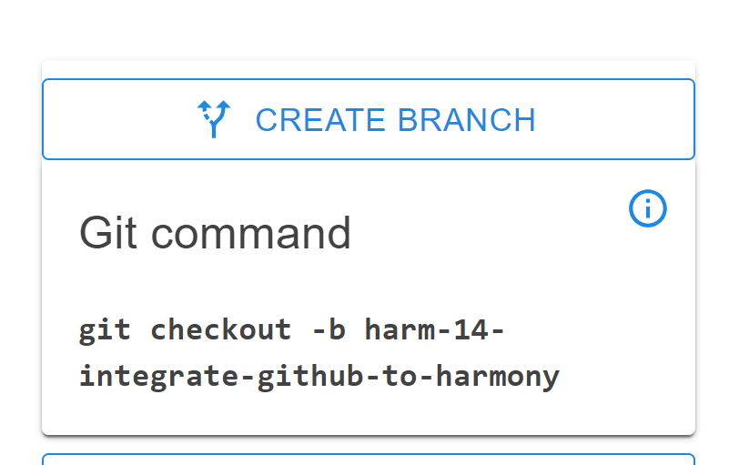
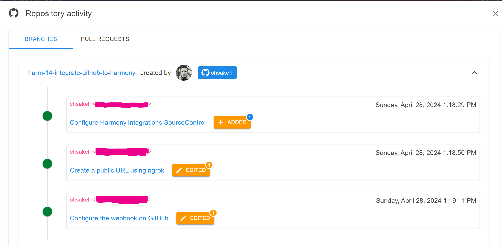

# GitHub

It is very easy to integrate **GitHub** activity to your Harmony instance. The integration is done through GitHub [webhooks](https://docs.github.com/en/webhooks/about-webhooks) requests which send a POST request with all the required information to the `GitHubController` controller existing in the <mark style="color:blue;">Harmony.Integrations.SourceControl</mark> application.

Integrating GitHub with your instance will allow you to see GIT activity such as branches, commits or pull requests, directly to your work items.

### Integration Configuration

There are two steps required to configure the GitHub integration. The first one is to configure the <mark style="color:blue;">Harmony.Integrations.SourceControl</mark> application & the next one is to setup the webhook URL on your GitHub account.&#x20;

#### Harmony.Integrations.SourceControl

This application is responsible to accept webhook requests coming from GitHub. Open its **appsettings.json** file and configure all the required connection strings for MongoDB, RabbitMQ & optionally ElasticSearch. For local development and assuming you have installed MonboDB & RabbitMQ as explained in the [installations.md](../configuration/dependencies/installations.md "mention")page, the configuration should look like the following, unless you used different options during installation:

```json
  "MongoDB": {
    "ConnectionURI": "mongodb://localhost:27017"
  },
  "BrokerConfiguration": {
    "Host": "localhost",
    "Port": 5672,
    "Username": "",
    "Password": "",
    "VirtualHost": ""
  },
  "ElasticConfiguration": {
    "Uri": "http://localhost:9200"
  }
```

By default, <mark style="color:blue;">Harmony.Integrations.SourceControl</mark> application will run on port **7113** as you can find in the **Properties/launchSettings.json** file. If running locally, you need to create a public URL that forwards the GitHub requests to your local instance and for this you can use [ngrok](https://ngrok.com/). It can generate a publicly accessible URL that forwards the requests to your local source control application.&#x20;

1. Create a free account & download the **ngrok agent** from [here](https://ngrok.com/download).
2. Extract the agent in a folder of your preference, e.g. **C:/tools/ngrok**
3. As soon as you create an account, **ngrok** creats an **authtoken** for you which you can find in the [your-authtoken](https://dashboard.ngrok.com/get-started/your-authtoken) page.
4. Open a terminal and navigate to the folder where you extracted ngrok agent and run the following command to configure ngrok auth-token:

```
.\ngrok.exe config add-authtoken <your-auth-token-here>
```

5. The last step is to create the tunnel to your application running at port 7113. Run the following command:

```
.\ngrok.exe http https://localhost:7113
```

This will create a public URL that you are going to use it as a webhook to GitHub!

<figure><figcaption><p>ngrok public URL</p></figcaption></figure>

#### GitHub WebHooks

Sign in to your GitHub account and configure the **Settings/Webhooks** either on a repository level or on an organization level.


If you have an organization with many repositories then it's more convenient to configure the webhooks on organization level because you only required to do it in one place. Otherwise you need to configure the webhooks in all of your repositories that are related to your harmony instance.

Organizations are free to create by the way but aren't required to configure the integration with harmony


1. In the webhooks page of either your organization or in one of your repository, fill the Payload URL with the ngrok URL generated in the previous step and set the _Content type_ to **application/json**. Notice the you have to add an extra **/github** at the end of the URL in order to send the requests to the correct GitHub controller existing in the app.

<figure><figcaption><p>GitHub webhook</p></figcaption></figure>

2. **Which events would you like to trigger this webhook?**\
   Check the **Let me select individual events** option and check the following events:

* Branch or tag creation
* Branch or tag deletion
* Pull requests
* Pushes

3. Activate the Webhook and save it.

### Card Git Activity

When you open a board's card, you will find git activity information on the right sidebar. If there isn't any branch created for this item, then a suggested git command will help you to create one.&#x20;


Branch names should contain the serial key of each item so that harmony can match all the git activity. The serial key consists of the board's KEY configured when you created and the item's number. You can find this information either directly from the board or by opening any card.\
\
**Valid branch names examples:**\
Assuming you have a card item with serial key equal to **HARM-10** and title **Support GitHub integration**, here are a few suggested branch names that will work as expected.

* [x] harm-10-support-github-integration
* [x] feature/harm-10-support-github-integration
* [x] support-github-integration-harm-10
* [x] harm-10

You don't have to use the card's title in your branch's name, the critical part that creates the bonding is the serial key, which in the previous case is the **harm-10**.\


* Harmony controller will try to figure out the serial key by running the **`([a-zA-Z]{3,5})-(\d+)`**regex on your branch name.&#x20;
* Avoid adding other numbers in your branch name


<figure><figcaption><p>Suggested git command to create a branch</p></figcaption></figure>

After creating a branch and as soon as it's being pushed to GitHub, this information will be updated with related information.

<figure><figcaption><p>Git summary details on card's view</p></figcaption></figure>

Clicking the VIEW DETAILS button will show you even more detailed information for the git activity related to this issue.

<figure><figcaption><p>Git activity</p></figcaption></figure>

### Notes

<mark style="color:blue;">Harmony.Integrations.SourceControl</mark> is exposed to the client via the Gateway. \
In a local dockerized environment you should run **ngrok** to expose the gateway's endpoint rather than the actual <mark style="color:blue;">Harmony.Integrations.SourceControl</mark>. Assuming the gateway runs on port **7108**, then the ngrok command should change to:

```
.\ngrok.exe http https://localhost:7108
```

Next the Webhook URL on GitHub will have the generated ngrokk URL plus the **/sourcecontrol/github** segment. Notice the extra **/sourcecontrol** part added here. This is required because now the application is exposed through the Gateway app.

Pending a YouTube video tutorial to show all these in action...
