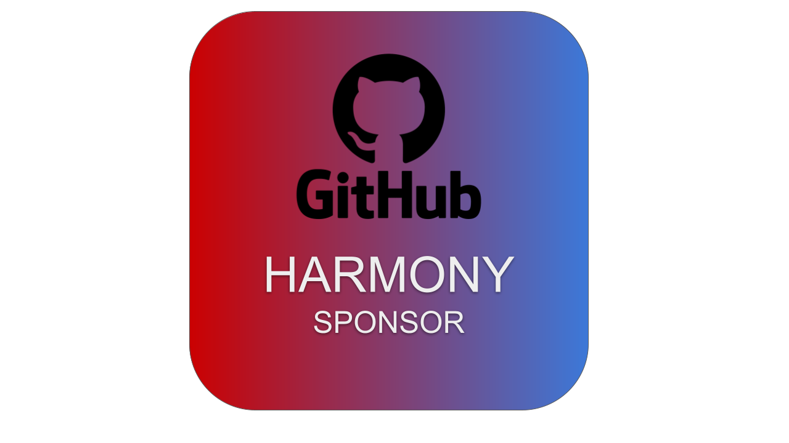
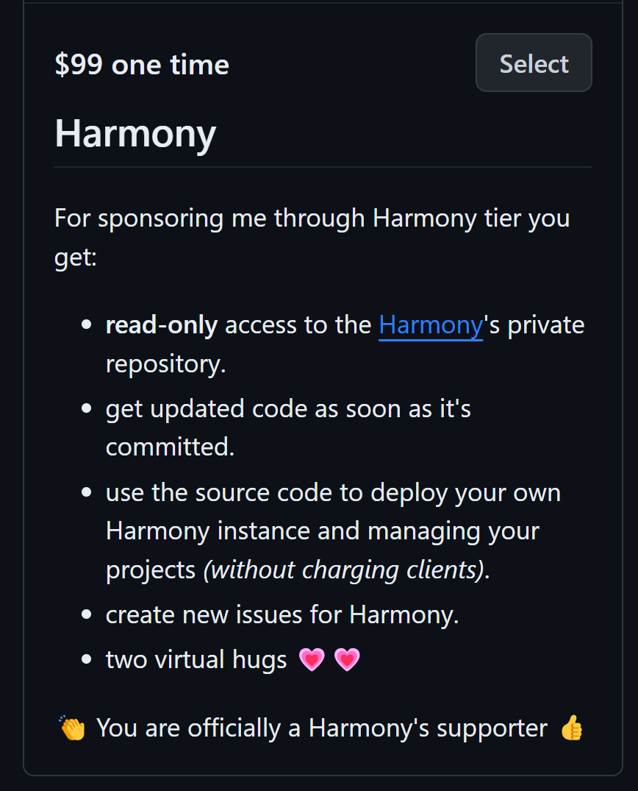
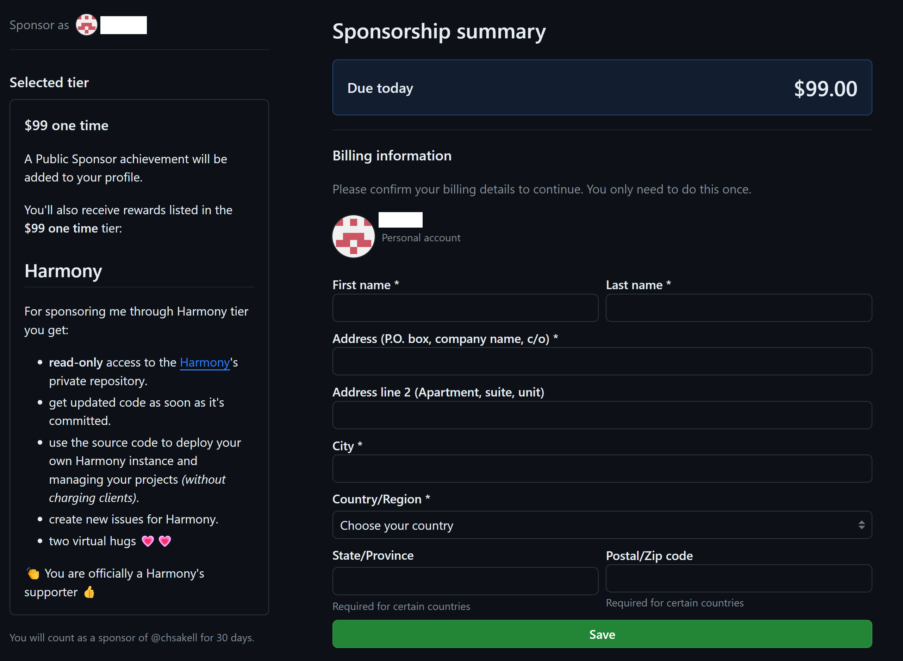

# 💳 Buy online

Harmony is currently available to buy via two channels, [GitHub](https://github.com/sponsors/chsakell) &  [**Envato**](https://codecanyon.net/item/harmony-project-management-tool/49138488) market:&#x20;

### GitHub sponsors

<figure><figcaption>
GitHub Harmony one-time sponsor tier
</figcaption></figure>

In order to get direct access to Harmony's **private** repository, navigate to its creator's sponsorship's [page](https://github.com/sponsors/chsakell) and select the Harmony **one-time** tier. You need to sign in with your **GitHub** account.

<figure><figcaption>
Harmony's one time tier
</figcaption></figure>

Select the Harmony tier & complete the purchase.

<figure><figcaption>
Complete transaction
</figcaption></figure>

After completing purchasing, your **GitHub** account will be granted read-only access to the repository in next few hours.

### Envato

Harmony is also available on [**Envato**](https://codecanyon.net/item/harmony-project-management-tool/49138488) market.&#x20;

Regardless the option you choose, after buying the product you will be able to:

* **View & study its full source code**: Thousands of code lines, built with .NET 8.0 and the best available [options](technology.md) _(e.g gRPC)_ for building scalable microservices. In case you are a .NET developer/engineer/architect you are going to love this project.
* **Host your own instance** of Harmony and manage your projects. Take harmony to the next level and try it on your own infrastructure.


**Harmony** is an amazing **state of the art** project written with best practices and latest technologies and it's expected to grow more. The price may rise in the future as more and more features are being added.

The **recommended** way to get access to Harmony's source code is using the Harmony **GitHub** sponsor tier instead of Envato market. Here's the benefits you get via GitHub:

* [x] Get instant access to all commits pushed to the repository :muscle:&#x20;
* [x] Better price :moneybag: since there are less fees than Envato
* [x] View **git history** and understand all the changes being made to the repository
* [x] You don't have to wait for Envato's approval process till you get updates


#### Buy from GitHub

Navigate to Harmony's sponsor tier by clicking [here](https://github.com/sponsors/chsakell).&#x20;

#### Buy from Envato


Envato market


#### Read next - Docs


[workspaces](../guide/workspaces/)



[kanban.md](../guide/kanban.md)



[scrum](../guide/scrum/)



[boards](../guide/boards/)

