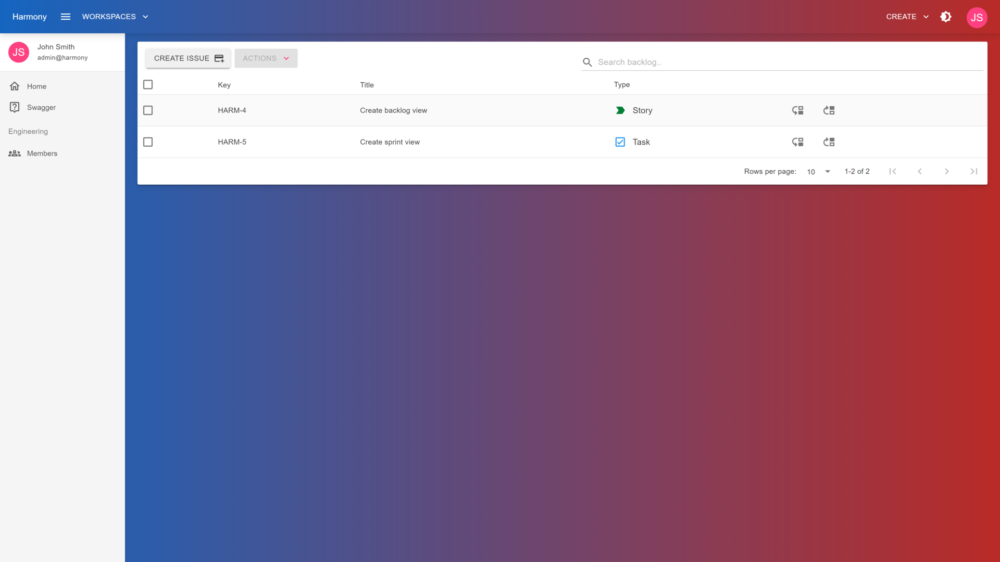
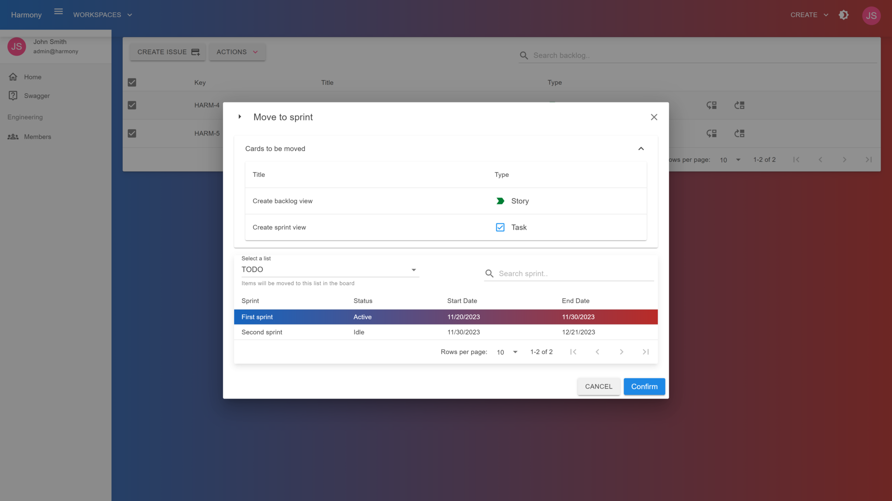
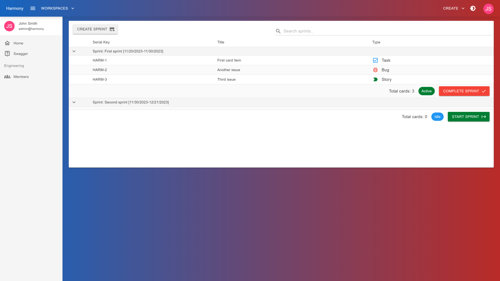
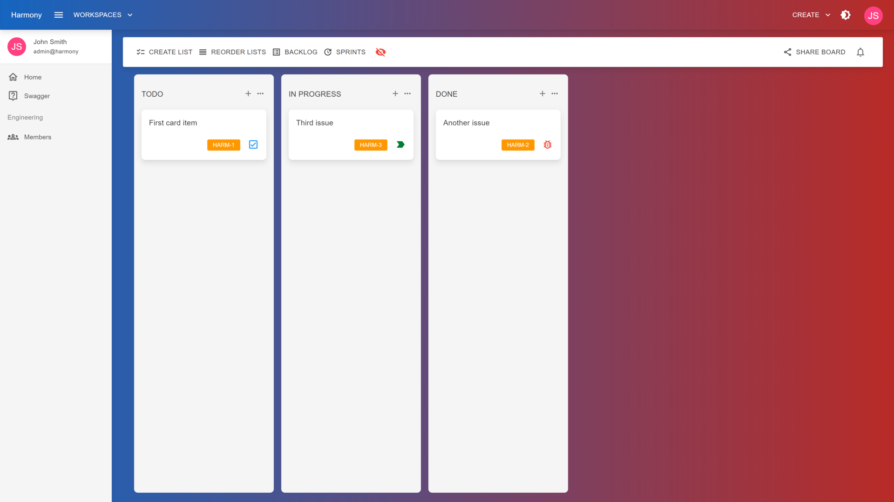
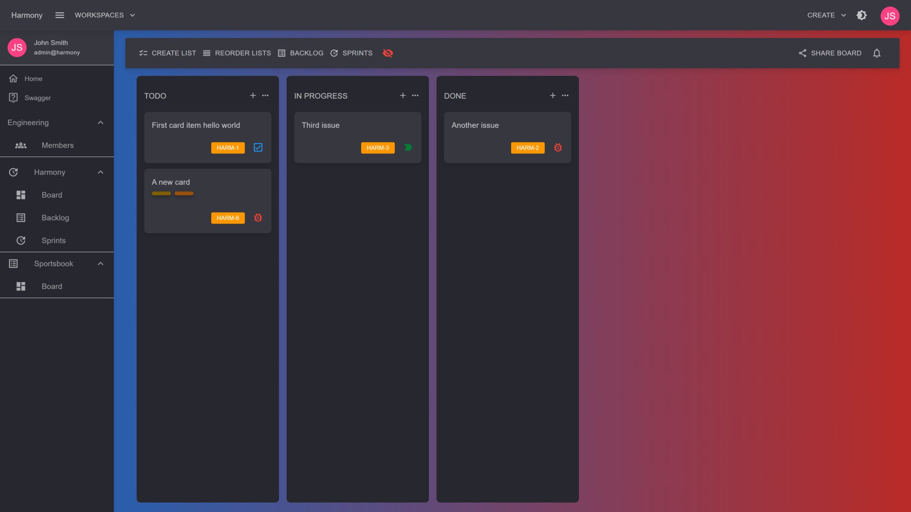

# 🔃 Changelog

Change log contains all version updates, old, current and upcoming with all important additions, fixes or improvements. The **unchecked** items of the _work in progress_ version, are the items remained before this build is released.

### \[Version 1.2] - Work in progress _(estimate 2 weeks)_


This update contains breaking changes so you will have to re-create the database from start. Just delete the Harmony database and re-run the project. After this update, breaking changes will be rare.


* [ ] Add support for Scrum Projects! :clap: :heart:
* [x] Create backlog
* [x] Create sprints
* [x] Start a sprint
* [ ] Complete a sprint & move any pending items to backlog or a different sprint
* [x] Move items from sprint to backlog
* [x] Move items from backlog to sprints
* [x] Introduce issue types for cards _(Epic, Bug, Task, Story, Task)_
* [x] Create **Serial Number** to easily identify cards/issues, e.g. HARM-1[^1]
* [x] Create board/sprint navigation items _(left menu & breadcrumbs)_
* [x] Change backlog items order

Here are some preview images from this iteration :eyes:

<figure><figcaption>
Backlog
</figcaption></figure>

 

<figure><figcaption>
Move items from backlog to sprint
</figcaption></figure>

 

<figure><figcaption>
Sprints
</figcaption></figure>

 

<figure><figcaption>
Board issue type &#x26; serial number
</figcaption></figure>

 

<figure><figcaption>
Nav menu for kanban &#x26; scrum projects
</figcaption></figure>

### \[Version 1.1] - Currently in review from Envato _(will be available soon, during this week)_

* [x] Add remove button to remove attachments
* [x] Clear card's dates
* [x] Update user's profile picture in all user card's components after uploading a picture in account page
* [x] Update text on **Enter** key pressed on _EditableTextField_ component
* [x] Display loader when creating cards
* [x] Scroll to the card's position added when creating a card within a list filled with multiple cards

### \[Version 1] - 14 November 2023 (currently available)

* [x] User registration / login
* [x] Create workspaces
* [x] Add users to workspaces
* [x] Create **KANBAN** boards
* [x] Add users to boards
* [x] Add lists to boards
* [x] Rename & reorder lists
* [x] Add cards to boards
* [x] Move cards
* [x] Assign users to cards
* [x] Add labels to cards
* [x] Toggle labels, add custom labels to board/cards
* [x] Add checklists to cards
* [x] Add check list items to checklists
* [x] Add start / due date to cards
* [x] Register some activities\

[^1]: First issue for a project named Harmony
