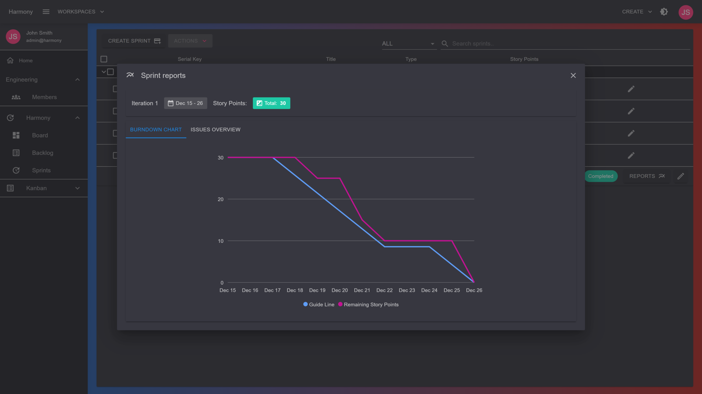
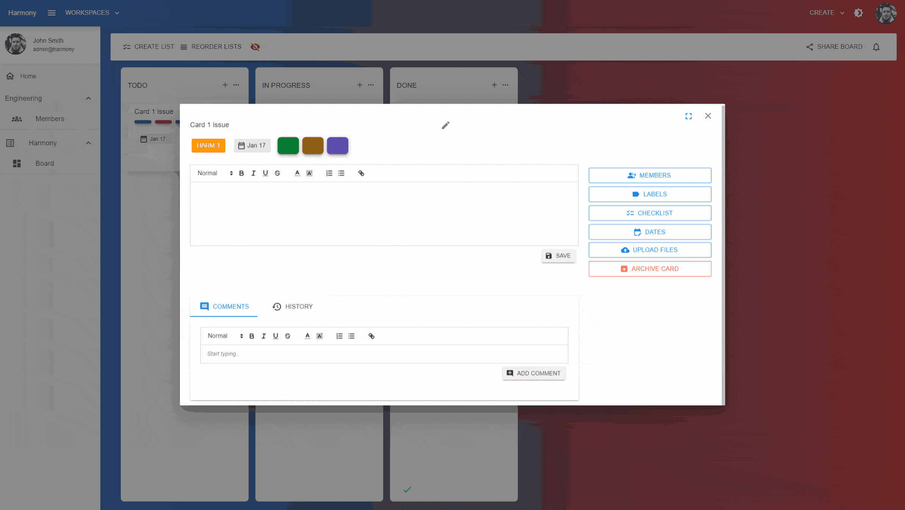
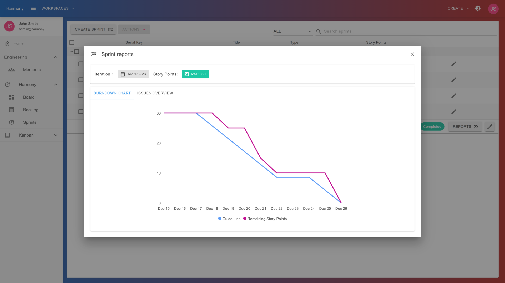
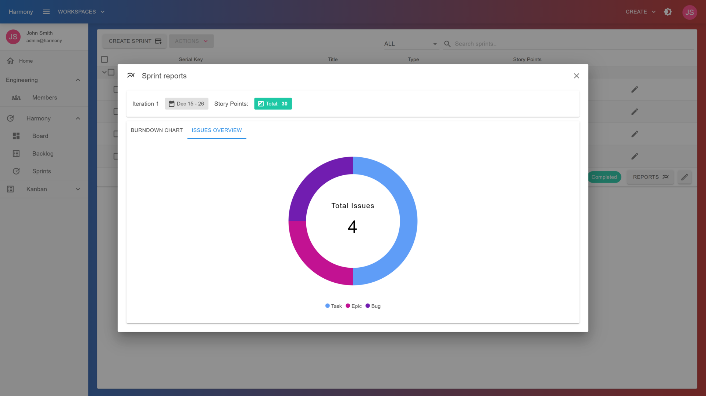
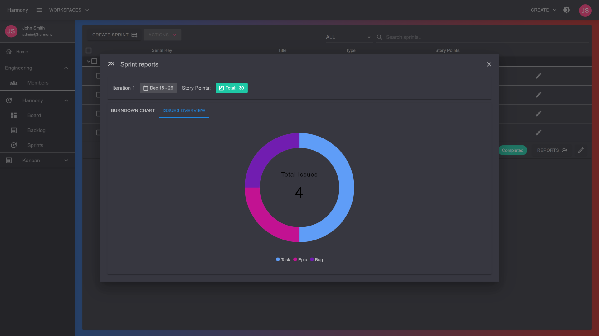
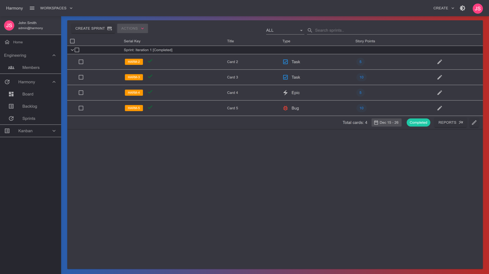

# 🔃 Changelog

Change log contains all version updates, old, current and upcoming with all important additions, fixes or improvements. The **unchecked** items of the _work in progress_ version, are the items remained before this build is released.

### \[Version 1.5] - Work in progress

> _We are searching for some kind of **harmony** between two intangibles: a form which we have not yet designed and a context which we cannot properly describe._\
> \
> [_**Christopher Alexander**_](#user-content-fn-1)[^1]


This version's goal is to add a **powerful Search textbox** at the top bar :mag\_right: .  \
Here are some of the features to be implemented in this release:


#### Features

* [ ] Integrate [Angolia](https://www.algolia.com/) search engine for super fast indexing & searching capabilities. Angolia is totally [free](https://www.algolia.com/pricing/) to use for **10000** requests per month  :muscle: and probably the easiest search engine to configure, existing at the moment
* [ ] Implement a database fallback search service in case there's no search engine integration configuration


**Why Angolia & not Elastic Search?**\

* Algolia search is [faster](https://www.algolia.com/blog/engineering/full-text-search-in-your-database-algolia-versus-elasticsearch/), more relevant, and easier to use than Elasticsearch for searching simple database data. Algolia's focus is on getting exceptional results with minimal configuration.&#x20;
* Elasticsearch is more flexible for searching complex data and can be used for a wider range of search applications.

\
<mark style="color:orange;">Who said Harmony won't add Elastic Search support in the future?</mark> :sunglasses:\ <mark style="color:orange;">Hamony is here to stay. Elastic Search support will be added as soon as possible.</mark>


### \[Version 1.4] -   available on [Envato](https://codecanyon.net/item/harmony-project-management-tool/49138488)


This version's goal is to add the first **charts** for monitoring a scrum project's progress :tada:. \
Also support for **adding comments** in cards will be added :speaking\_head:


#### Features

* [x] Create, edit, delete comments :writing\_hand::pencil:
* [x] Implement **story points** for issues
* [x] Add burndown chart report for scrum sprints :chart\_with\_upwards\_trend:
* [x] View card in **Fullscreen** :clap: :100:
* [x] Display number of comments on board
* [x] Update backlog item inline :muscle::clap:
* [x] Update sprint item inline :tada:

#### Fixes

* [x] Fix RabbitMQ configuration _(add username, password, virtual host)_
* [x] Fix validation issue on edit sprint modal
* [x] Load board query fixes for scrum projects

<figure><figcaption></figcaption></figure>

<figure><figcaption>
Comments &#x26; Fullscreen preview
</figcaption></figure>

 

<figure><figcaption></figcaption></figure>

 

<figure><figcaption></figcaption></figure>

 

<figure><figcaption></figcaption></figure>

 

<figure><figcaption></figcaption></figure>

### \[Version 1.3] - 6 December 2023


This version's goal was to **add email notifications** using Gmail configuration and optional email service provider such as Brevo. For best practices and scaling capabilities, a new project was created, responsible to send the notifications. The entire setup will be based on **RabbitMQ** messaging & **HangFire**.

Other than that, there were **fixes** and an amazing UX improvement on the board level and specifically when **moving cards**. It became more responsive while it also syncs the board status across all connected members


* [x] **RabbitMQ** messaging integration
* [x] New **Harmony.Notifications** web application with **HangFire** integration for background jobs
* [x] Add **Gmail** integration for email notifications
* [x] &#x20;Add [Brevo](https://www.brevo.com/products/transactional-email/) integration for email notifications

#### UI changes

* [x] Add **due date reminder field** on card's date edit view _(e.g. 1 day before, 1 hour before, etc..)_
* [x] 3 default board lists are added for Kanban projects as well
* [x] Add user options for enabling/disabling notifications
* [x] UX board improvements

#### Notifications implemented so far

* [x] Member added to a workspace
* [x] Workspace access revoked from member
* [x] Member added to a board
* [x] Board access revoked from member
* [x] Issue completed _(moved to a list marked as DONE)_
* [x] Due date based on due date reminder type
* [x] Member assigned to card
* [x] Member has given access to board
* [x] Board access revoked

#### Fixes

* [x] Fixes for card movement in the board, especially with positioning
* [x] Fix typo error when building in **Release** mode
* [x] Ensure _Files_ folder exists inside the published folder when publishing **Harmony.Server** web app

### \[Version 1.2] - 24 November 2023

* [x] Add support for Scrum Projects! :clap: :heart::rocket:
* [x] Create backlog
* [x] Create sprints
* [x] Start a sprint
* [x] Complete a sprint & move any pending items to backlog or a different sprint
* [x] Move items from sprint to backlog
* [x] Move items from backlog to sprints
* [x] Introduce issue types for cards _(Epic, Bug, Task, Story, Task)_
* [x] Create **Serial Key** to easily identify cards/issues, e.g. HARM-1[^2]
* [x] Create board/sprint navigation items _(left menu & breadcrumbs)_
* [x] Change backlog items order

#### Enhancements

* [x] Add remove button to remove attachments
* [x] Clear card's dates
* [x] Update user's profile picture in all user card's components after uploading a picture in account page
* [x] Update text on **Enter** key pressed on _EditableTextField_ component
* [x] Display loader when creating cards
* [x] Scroll to the card's position added when creating a card within a list filled with multiple cards

### \[Version 1] - 14 November 2023

* [x] User registration / login
* [x] Create workspaces
* [x] Add users to workspaces
* [x] Create **KANBAN** boards
* [x] Add users to boards
* [x] Add lists to boards
* [x] Rename & reorder lists
* [x] Add cards to boards
* [x] Move cards
* [x] Assign users to cards
* [x] Add labels to cards
* [x] Toggle labels, add custom labels to board/cards
* [x] Add checklists to cards
* [x] Add check list items to checklists
* [x] Add start / due date to cards
* [x] Register some activities

#### Read next - Technology


[technology.md](technology.md)


[^1]: Christopher Wolfgang John Alexander (4 October 1936 – 17 March 2022) was an Austrian-born British-American architect and design theorist. He was an emeritus professor at the University of California, Berkeley. His theories about the nature of human-centered design have affected fields beyond architecture, including urban design, software, and sociology.

[^2]: First issue for a project named Harmony
