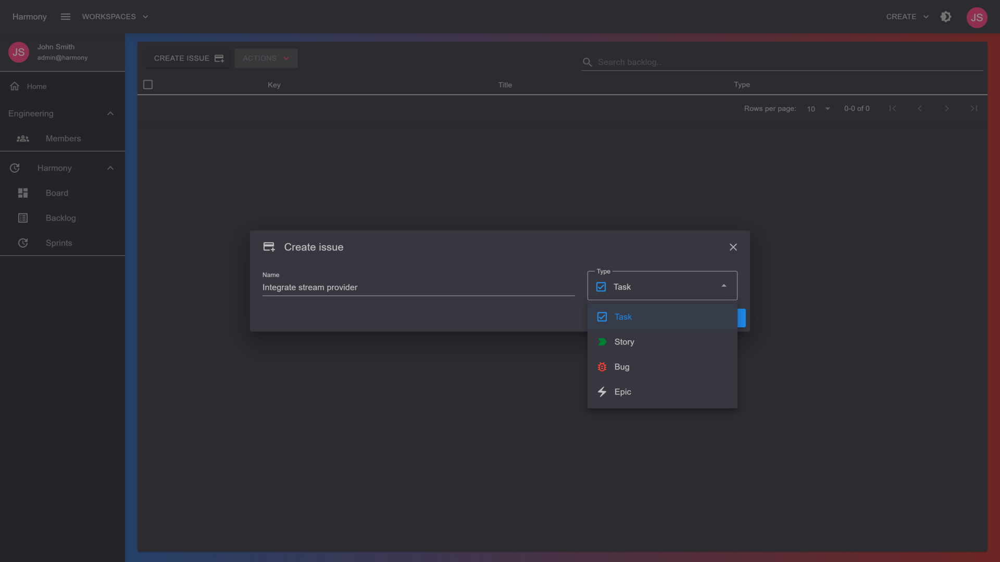
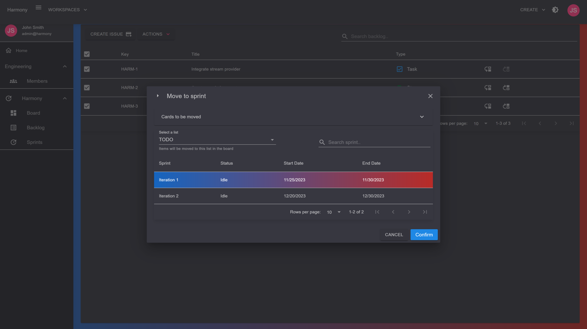
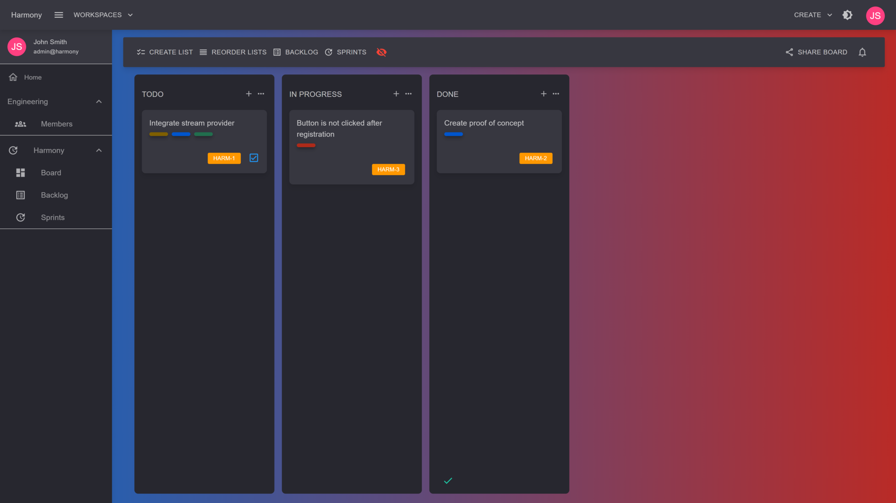

# ✨ Features

## Kanban Boards

Harmony already implements most features if not all, of a Kanban style project management's tool such as **Trello**. The entire process on how to create workspaces, boards, lists etc.. is described on the **GUIDE** section of the docs. Expect to see a smooth application with instant updates via WebSocket across all board members.

<figure><figcaption>
Kanban board
</figcaption></figure>

## Scrum Projects

Scrum projects allow you to plan your work in a **backlog** and organize cycles of work into **sprints**. It's recommended for large, complex projects. Harmony's goal is to provide most if not all scrum features provided by **Jira**.&#x20;

<figure><figcaption>
Backlog
</figcaption></figure>

 

<figure><figcaption>
Backlog to sprint
</figcaption></figure>

 

<figure><figcaption>
Sprints
</figcaption></figure>

 

<figure><figcaption>
Scrum project board
</figcaption></figure>


All board updates are smoothly synced via WebSocket connection across all connected members


#### Read next - Roadmap


[roadmap.md](roadmap.md)

