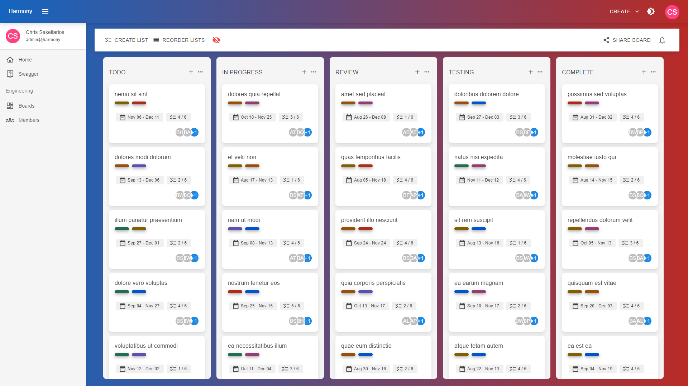
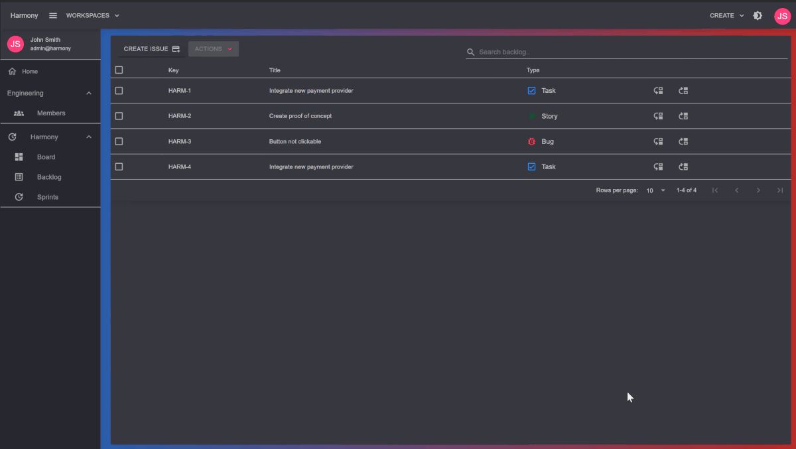
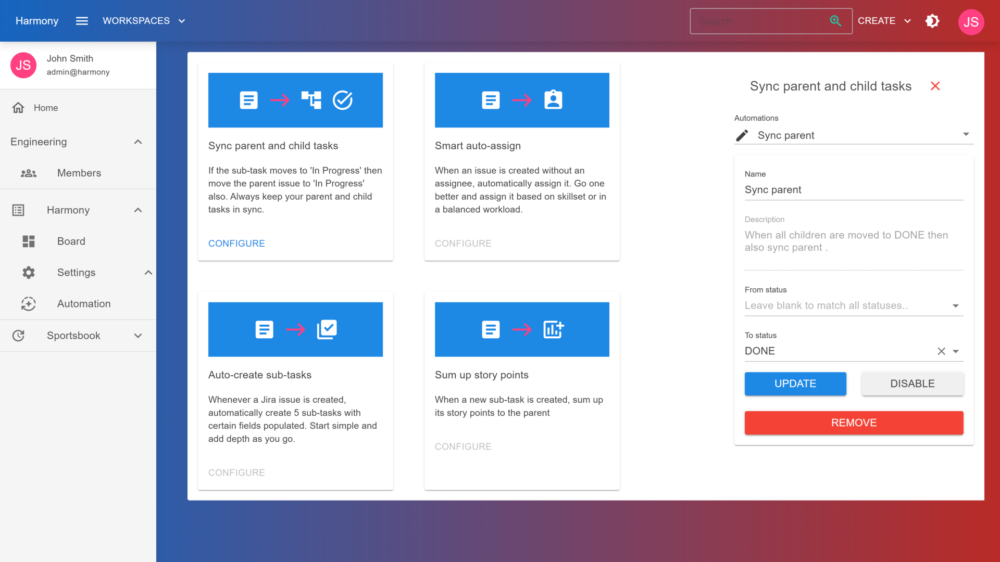
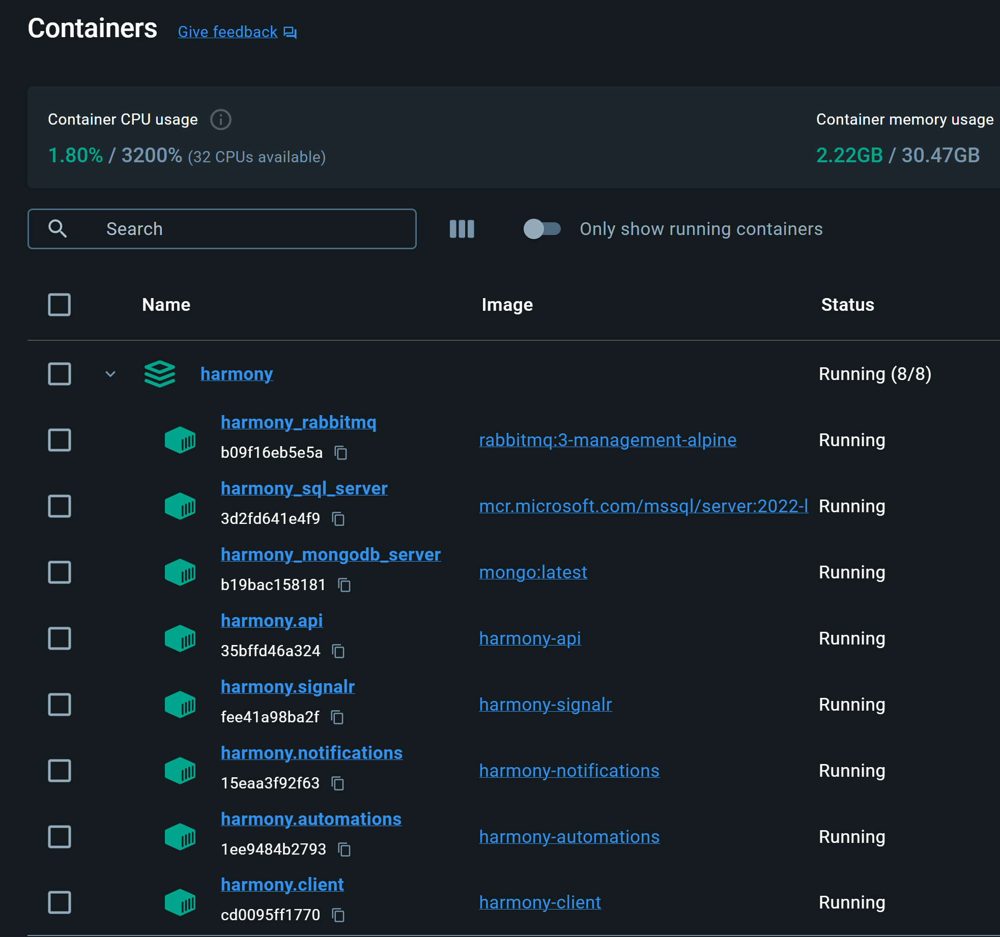
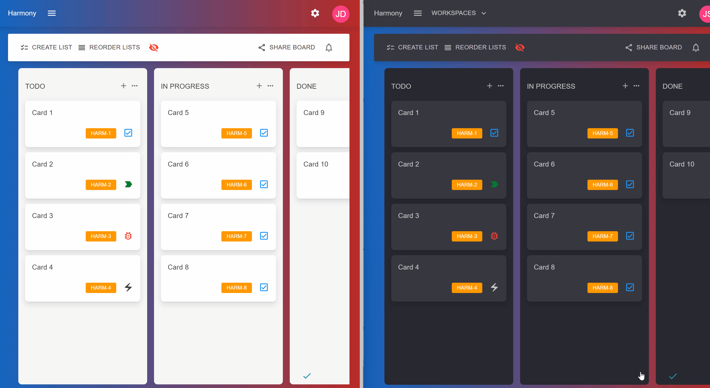

# ✨ Features

### Kanban Boards

Harmony already implements most features if not all, of a Kanban style project management's tool such as **Trello**. The entire process on how to create workspaces, boards, lists etc.. is described on the **GUIDE** section of the docs. Expect to see a smooth application with instant updates via WebSocket across all board members.

<figure><figcaption>
Kanban board
</figcaption></figure>

### Scrum Projects

Scrum projects allow you to plan your work in a **backlog** and organize cycles of work into **sprints**. It's recommended for large, complex projects. Harmony's goal is to provide most if not all scrum features provided by **Jira**.&#x20;

<figure><figcaption>
Backlog &#x26; Sprints
</figcaption></figure>

### Batteries included :battery: - Automations

[Automations](../guide/automations/) couldn't miss from Harmony - Configure automations on a simple yet elegant interface.

<figure><figcaption>
Automations
</figcaption></figure>

### Retrospective boards

A retrospective is an opportunity to learn and improve, in a fun environment. To break it down in the simplest way you should cover:

* What worked well?
* What didn't work well?
* What actionable items can we do to improve the situation?

These are generally quick sessions that are not only informative and contribute to the team's functionality and efficiency, but also do something most ‘Retrospectives’ forget to do: Engage the team.

Starting from version 2.10, retrospective boards are available for scrum projects :rocket: :muscle:

### Docker ready :whale: :rocket:

Built with best practices, latest technologies and most popular tools and frameworks, broken in isolated and scalable microservices, Harmony can be served via [docker](setup/docker/) containers. [Kubernetes ](setup/docker/kubernetes.md)deployment is also available! :muscle:

<figure><figcaption>
Harmony docker containers
</figcaption></figure>

### Board auto-syncing


All board updates are smoothly synced via WebSocket connection across all connected members


<figure><figcaption>
Syncing board across different connections
</figcaption></figure>

### Full list of features currently supported

#### Project oriented features

* [x] Create workspaces
* [x] Create Kanban projects
* [x] Create Scrum projects
* [x] Email notifications
* [x] Powerful search with search engine integration _(new)_ :rocket:
* [x] Dark & light theme included

#### Scrum features

* [x] Build and plan your backlog
* [x] Create sprints
* [x] Move issues between backlog & sprints
* [x] Start & complete sprints - move pending items to backlog or new sprint upon completion
* [x] Display **burndown** chart (new) :rocket: :chart\_with\_upwards\_trend:
* [x] Create retrospective for sprints

#### Board features

* [x] Add, rename and re-order board lists _(e.g. TODO, IN PROGRESS, DONE etc..)_
* [x] Add new issues to board lists - issues are assigned a type _(task, story, bug or epic)_
* [x] Move issues between board lists or re-order in the same list
* [x] Edit card's title _(card = issue)_
* [x] Edit card's description with an integrated **text editor**
* [x] Add labels to a card - predefined or new custom created
* [x] Remove labels from card
* [x] Set due date for an issue
* [x] Add check lists with items in a card
* [x] Assign member(s) to an issue
* [x] Upload attachments to a card
* [x] Remove attachments from a card
* [x] Add, edit and remove comments to a card  (new) :rocket:
* [x] Archive a card
* [x] Display & re-activate archived cards

#### Automations

* [x] [Sync parent and child tasks](../guide/automations/sync-parent-and-child-tasks.md)
* [x] [Smart auto-assign](../guide/automations/smart-auto-assign.md)
* [ ] Auto-create sub-tasks
* [x] Sum up story points

More automations to be added soon..

#### Member features

* [x] Register a new user
* [x] Login
* [x] Add a member to a workspace
* [x] Share a project _(board)_ with a member
* [x] Remove members from workspaces & projects
* [x] Edit user account
* [x] Upload profile picture :frame\_photo:
* [x] Configure email notifications :envelope:

#### Harmony VS other popular project management tools

* [x] **One time** small purchase rather than monthly or yearly payments :credit\_card::date:
* [x] There are no limitations or premium features! :clap: - Everything that becomes available on each release becomes available to use for everyone.
* [x] Full **source code** available _(thousands of lines..)_ :tada: :muscle: - Harmony is built using best code practices and patterns.
* [x] Host your own instance - scale on demand based on your requirements.
* [x] Beautiful, simple and easy to use UI.


For a complete list of features, fixes, enhanced being added to Harmony on every release, you can always check the [changelog](changelog.md) :bulb:


#### Read next - Roadmap


[changelog.md](changelog.md)



[roadmap.md](roadmap.md)



[pricing.md](pricing.md)

