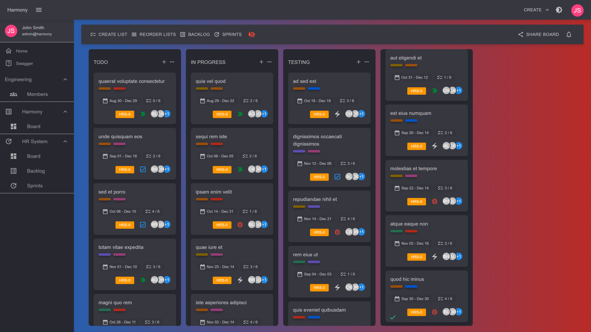

# ✨ Features

## Kanban Boards

Harmony already implements most features if not all, of a Kanban style project management's tool such as **Trello**. The entire process on how to create workspaces, boards, lists etc.. is described on the **GUIDE** section of the docs. Expect to see a smooth application with instant updates via WebSocket across all board members.

<figure><figcaption>
Kanban board
</figcaption></figure>

## Scrum Projects

Scrum projects allow you to plan your work in a **backlog** and organize cycles of work into **sprints**. It's recommended for large, complex projects. Harmony's goal is to provide most if not all scrum features provided by **Jira**.&#x20;

<figure><figcaption>
Scrum project board
</figcaption></figure>

<figure><figcaption>
Backlog
</figcaption></figure>

 

<figure><figcaption>
Backlog to sprint
</figcaption></figure>

 

<figure><figcaption>
Sprints
</figcaption></figure>


All board updates are smoothly synced via WebSocket connection across all connected members


### Full list of features currently supported

#### Project oriented features

* [x] Create workspaces
* [x] Create Kanban projects
* [x] Create Scrum projects
* [x] Email notifications (new) :rocket:
* [x] Dark & light theme included

#### Scrum features

* [x] Build backlog
* [x] Create sprints
* [x] Move issues between backlog & sprints
* [x] Start & complete sprints

#### Board features

* [x] Add, rename and re-order board lists _(e.g. TODO, IN PROGRESS, DONE etc..)_
* [x] Add new issues to board lists - issues are assigned a type _(task, story, bug or epic)_
* [x] Move issues between board lists or re-order in the same list
* [x] Edit card's title _(card = issue)_
* [x] Edit card's description with an integrated **text editor**
* [x] Add labels to a card - predefined or new custom created
* [x] Remove labels from card
* [x] Set due date for an issue
* [x] Add check lists with items in a card
* [x] Assign member(s) to an issue
* [x] Upload attachments to a card
* [x] Remove attachments from a card
* [x] Archive a card

#### Member features

* [x] Register a new user
* [x] Login
* [x] Add a member to a workspace
* [x] Share a project _(board)_ with a member
* [x] Remove members from workspaces & projects
* [x] Edit user account
* [x] Upload profile picture

#### Read next - Roadmap


[roadmap.md](roadmap.md)

