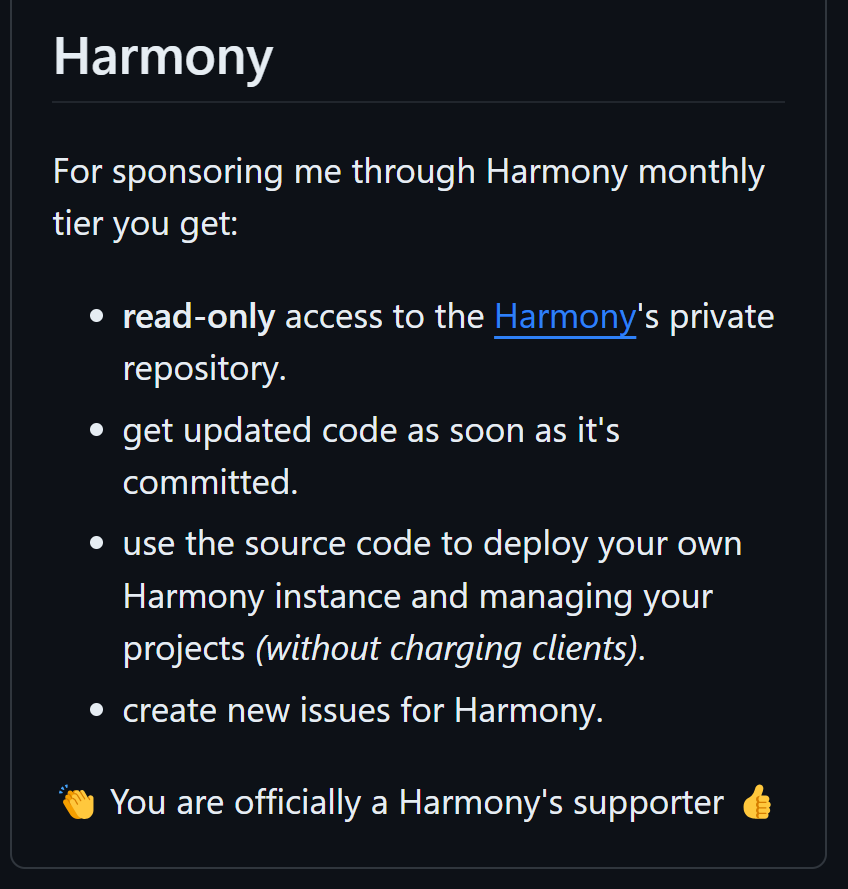
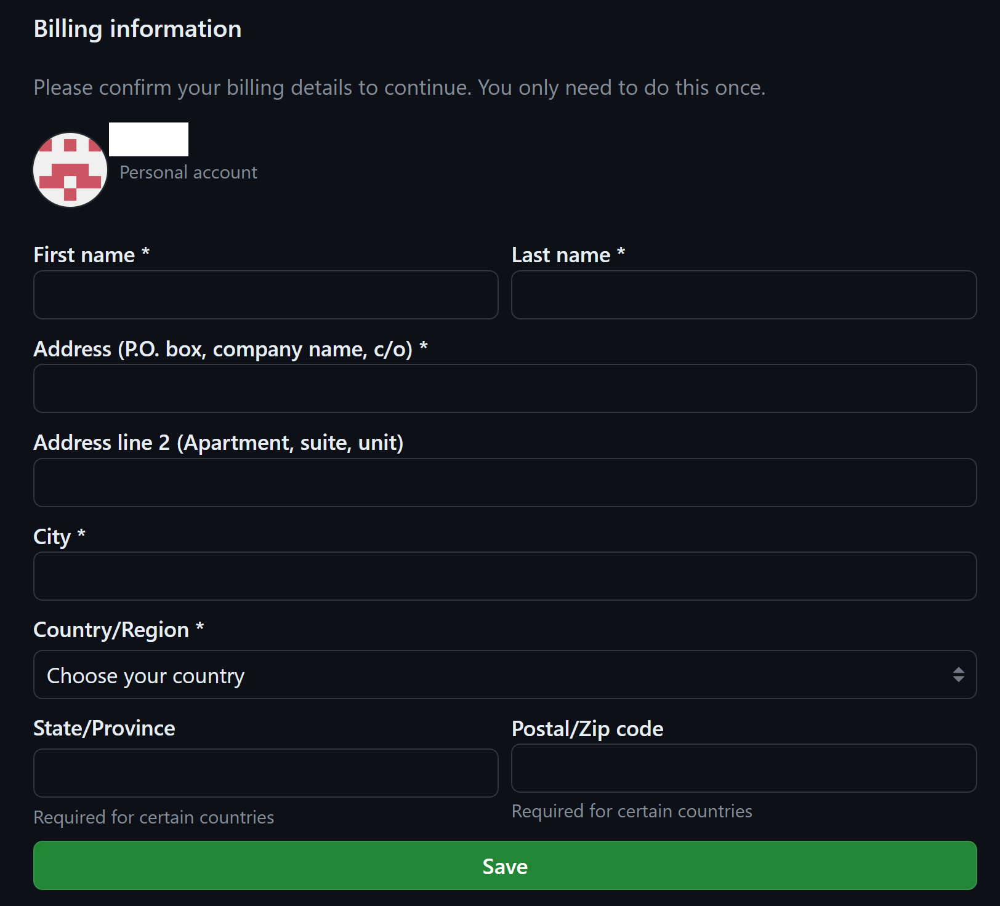

# 💳 Pricing

Harmony is currently available to buy via two channels, [**GitHub**](https://github.com/sponsors/chsakell) &  [Envato](https://codecanyon.net/item/harmony-project-management-tool/49138488) market.


You are recommended to buy Harmony from [GitHub](https://github.com/sponsors/chsakell) using one of the available sponsorships plans that suit your needs, rather than envato market which is much more expensive due to their high fees.&#x20;


### GitHub sponsors

<figure><figcaption>
GitHub Harmony one-time sponsor tier
</figcaption></figure>

In order to get direct access to Harmony's **private** repository, navigate to its creator's sponsorship [page](https://github.com/sponsors/chsakell) and select one of the Harmony's tiers.&#x20;

* **Monthly**: Get access to Harmony's repository for only **10$** per month. Your access is remained as long as you are subscribed to the tier. \
  Choose this tier, if you want to take a look at how an amazing project management tool can be implemented using the latest [technologies](technology.md) and best practices existing for building microservices _(best suitable for developers/engineers/architects)_<mark style="color:blue;">.</mark>
* **One-time**: Pay once and get a **life-time** access to the repository.  \
  Choose this tier, if you are interested in both technical and product features in a **long term**.  Harmony will continue to evolve for a long time so with this plan you gain life-time access to code changes, architectural improvements, product additions, bug fixes, etc.\
  There are two one-time plans, <mark style="color:blue;">69$</mark> & <mark style="color:blue;">99$</mark> which work the same _(the latter can be used as a sign of appreciation for this state of the art solution which requires hard work and effort to maintain)._

<figure><figcaption>
Harmony tier
</figcaption></figure>

1. You need to sign in with your **GitHub** account. In case you don't already have you can create one for free.
2. Select either a **monthly** or an **one-time** Harmony tier & complete the purchase.

<figure><figcaption></figcaption></figure>

After completing purchasing, your **GitHub** account will be granted read-only access to the repository in next few minutes or hours.

### Envato

Harmony is also available on [**Envato**](https://codecanyon.net/item/harmony-project-management-tool/49138488) market.&#x20;

Regardless the option you choose, after buying the product you will be able to:

* **View & study its full source code**: Thousands of code lines, built with .NET 8.0 and the best available [options](technology.md) _(e.g gRPC)_ for building scalable microservices. In case you are a .NET developer/engineer/architect you are going to love this project.
* **Host your own instance** of Harmony and manage your projects. Take harmony to the next level and try it on your own infrastructure.


**Harmony** is an amazing **state of the art** project written with best practices and latest technologies and it's expected to grow more. The price may rise in the future as more and more features are being added.

Here are a few benefits you get via GitHub plan:

* [x] Get instant access to all commits pushed to the repository :muscle:&#x20;
* [x] View **git history** and understand all the changes being made to the repository
* [x] You don't have to wait for Envato's approval process till you get updates


#### Buy from GitHub

Navigate to Harmony's sponsor tier by clicking [here](https://github.com/sponsors/chsakell).&#x20;

#### Buy from Envato


Envato market


#### Read next - Docs


[workspaces](../guide/workspaces/)



[kanban.md](../guide/kanban.md)



[scrum](../guide/scrum/)



[boards](../guide/boards/)

