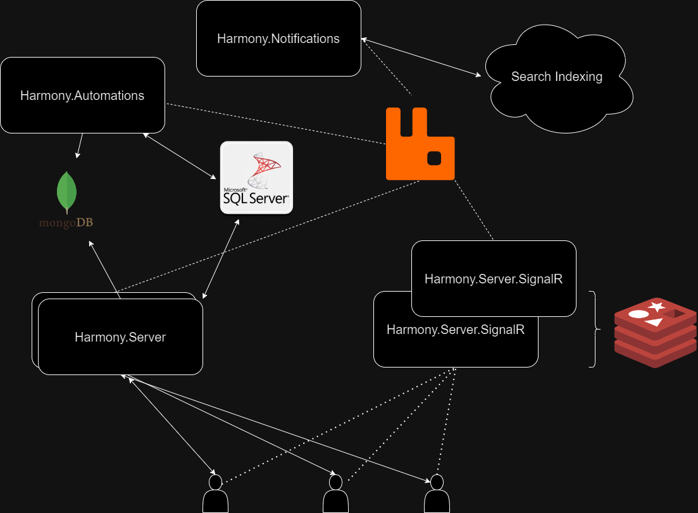

# ⚙ Setup

Harmony on its core is a web application built with **.NET Core** which means it's a cross platform app and can be deployed anywhere _(Windows, Linux, Mac)_. On the other hand, it can be seen as a large scalable system consisting by several .NET Core applications and other components, each one having a specific responsibility. Because of this, it's highly advised that you have understood its architecture and carefully follow and configure one by one the required dependencies before running Harmony.

<figure><figcaption>
Harmony architecture overview
</figcaption></figure>

#### Architecture explained

* **Harmony.Server** serves the ASP.NET Core Blazor web app
* Clients connect to an instance of **Harmony.SignalR** web app which is responsible to push instant updates via WebSocket. Messages can be sent from any application via RabbitMQ. Scaling is supported via Redis Backplane.
* **SQL Serve**r stores the required domain entities (workspaces, boards, cards, users)
* Automations are stored in a MongoDB database. Automations are configured/written via the Harmony.Server web app and being read from **Harmony.Automations** upon message received via a RabbitMQ message.
* **Harmony.Notifications** is responsible for sending email notifications to users & optionally sending indexing requests to an integrated search service _(if any)_.


Configure one by one the following components - Each link provides details about the role of the corresponding component and how to configure it. After finishing with the component's setup, follow with the individual web app configurations _(e.g. appsettings.json)_


Harmony dependencies are:

* **Databases**: Harmony uses SQL Server, MongoDB & and Redis by individual apps. Before configuring read the [databases](databases/ "mention") guide to understand the purpose of each database provider.
* An **SQL Server** & and a **MongoDB Server** which can be installed on Windows or [Linux](https://learn.microsoft.com/en-us/sql/linux/sql-server-linux-setup?view=sql-server-ver16#supportedplatforms).  Read the [sql-server.md](databases/sql-server.md "mention")and [mongodb-server.md](databases/mongodb-server.md "mention")to setup the required database providers.
* A **Redis** instance: Redis backplane is used for scaling **Harmony.SignalR** application. Read the [redis.md](databases/redis.md "mention") section to setup Redis and Harmony.SignalR project's configuration.
* A **RabbitMQ** instance for asynchronously  exchanging messages between Harmony's components. Read the [rabbitmq.md](rabbitmq.md "mention") section to setup RabbitMQ.
* Email service provider: Harmony needs you to configure an email service provider so that it can send the email notifications. Currently Gmail & [Brevo](https://www.brevo.com/products/transactional-email/) are supported but it's very easy to add your own provider. Read the  [email-provider.md](email-provider.md "mention") guide for more information about how to setup an email provider.
* Search engine (optional): Harmony provides a powerful search engine functionality that can be configured either via direct database search or using a 1st class indexing service named [Algolia ](https://www.algolia.com/products/ai-search/)_(it's free by the way for 10000 req/month)_.. Read the [search](search-engine.md) section for more details.
* **Harmony.Notifications**: A web application that subscribes to RabbitMQ messages and handles email and search index notifications.


In one of the upcoming releases Harmony will be able to run via **docker** commands



[databases](databases/)



[rabbitmq.md](rabbitmq.md)



[search-engine.md](search-engine.md)



[email-provider.md](email-provider.md)



[deployment.md](deployment.md)


#### Make Harmony yours - Buy once, get updates for ever :rocket:


[buy-online.md](../buy-online.md)

