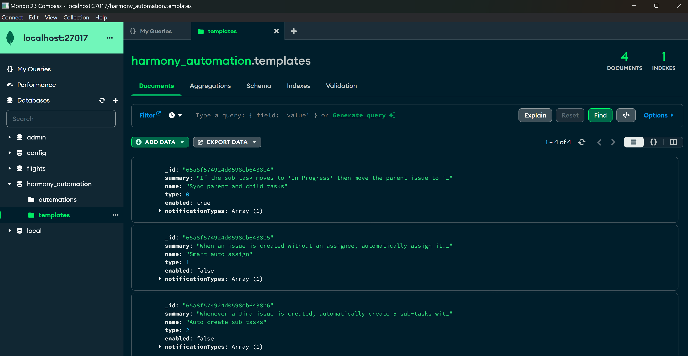

# MongoDB Server

[MongoDB](https://www.mongodb.com/) is used to support automations in Harmony. You can either install MongoDB Server locally or run a MongoDB docker container, it's up to you. The only thing you need to configure is the MongoDB connection string in the **appsettings.json** file in the <mark style="color:blue;">**Harmony.Api**</mark> & <mark style="color:blue;">**Harmony.Automations**</mark> projects. The following configuration connects to a local MongoDB server instance.

```json
  "MongoDB": {
    "ConnectionURI": "mongodb://localhost:27017"
  },
```

You don't have to create the database manually, when you fire up Harmony.Automations, it will automatically create the database and seed some automation templates for you. Then you can access a board's **automation settings page** and configure automations for a project.

<figure><figcaption><p>MongoDB automation templates</p></figcaption></figure>
