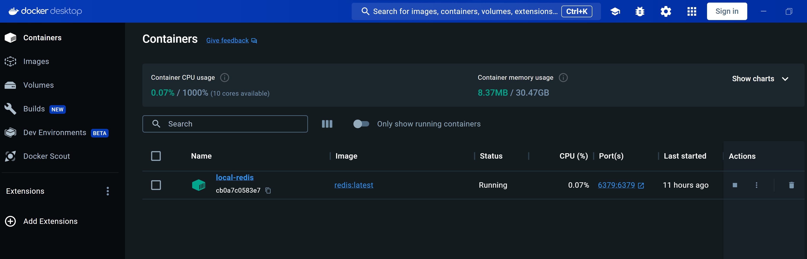
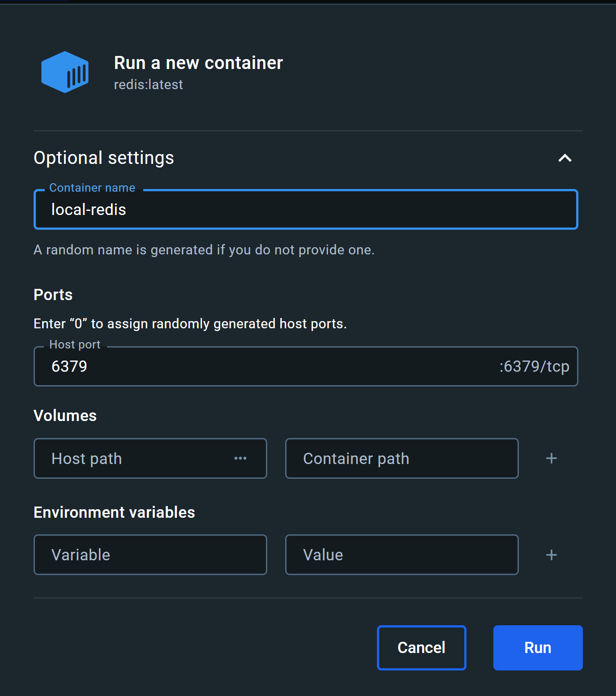

# Redis

[Redis](https://redis.io/) is an open-source in memory data source used by Harmony for scaling <mark style="color:blue;">**Harmony.SignalR**</mark> application.  Clients served by the <mark style="color:blue;">**Harmony.Server**</mark> app, connect to an instance of <mark style="color:blue;">**Harmony.SignalR**</mark> application to receive instance updates via WebSocket. [Redis backplance](https://learn.microsoft.com/en-us/aspnet/core/signalr/redis-backplane?view=aspnetcore-8.0) is used to support the scenario where you may have multiple instances of Harmony.SignalR app and different clients have been connected to different instances. Applications send messages to Harmony.SignalR via RabbitMQ messages.

### Installation

Follow the official installation [instructions](https://redis.io/docs/install/install-redis/) for installing Redis on your environment. The easiest way to run a redis instance locally is by using a docker container. Make sure you expose a port outside the container so that other apps can connect to it.

Next configure the **RedisConnectionString** connection string in the **appsettings.json** for Harmony.Signalr project. The following configuration connects to a local Redis instance listening to the default 6379 port.

```json
"RedisConnectionString": "127.0.0.1:6379",
```

<figure><figcaption></figcaption></figure>

<figure><figcaption></figcaption></figure>

#### Read next - Configure RabbitMQ


[rabbitmq.md](../rabbitmq.md)

