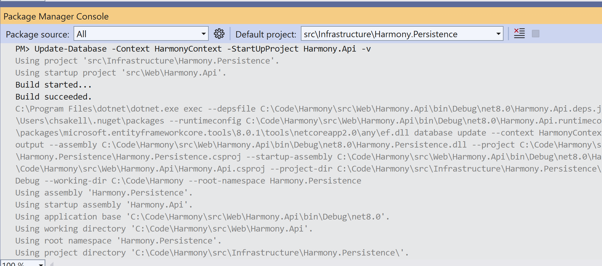
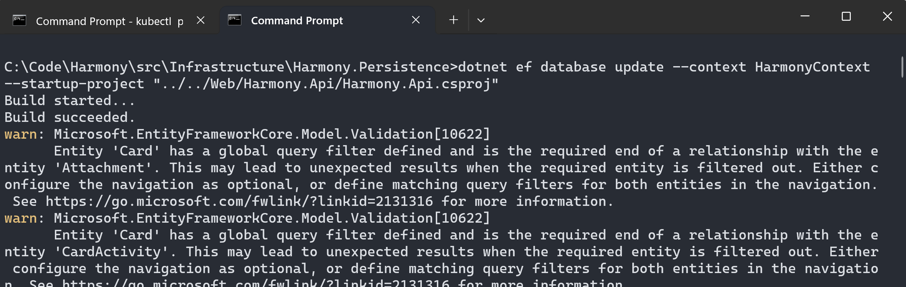

# SQL Server

Harmony has a dependency to **SQL Server** databases which can be installed on Windows or [Linux](https://learn.microsoft.com/en-us/sql/linux/sql-server-linux-setup?view=sql-server-ver16#supportedplatforms). After installing an SQL Server instance, proceed by creating the required databases and configuring the connection strings for the following two databases:

1. **Harmony**: The core database used by the <mark style="color:blue;">Harmony.Api</mark> server app, containing all the core tables and their relationships, e.g. Workspaces, Boards or Cards.
2. **Harmony.Notifications.Jobs**: The database used by the <mark style="color:blue;">Harmony.Notifications</mark> web app, containing all the HangFire required tables and one more.
3. **Harmony.Automations.Jobs**: The database used by the <mark style="color:blue;">Harmony.Automations</mark> web app, containing all the HangFire required tables and one more.

### Harmony database configuration

#### Database connection string

Configure the <mark style="color:orange;">HarmonyConnection</mark> SQL Server's connection string existing in the <mark style="color:blue;">**appsettings.json**</mark> file at the root of the **Harmony.Api** project to point to your SQL Server instance.

```json
  "ConnectionStrings": {
    "HarmonyConnection": "Server=.;Database=Harmony;Integrated Security=True;TrustServerCertificate=True"
  }
```

#### Database migrations

You can run the database migrations either manually or **let the projects run them for you** during startup.

#### Run migrations through <mark style="color:blue;">Visual Studio</mark>

When running migrations through Visual Studio, open the `Package Manager Console` and set the `Default project` to **src\Infrastructure\Harmony.Persistence**.

Run the following command to create the database:

```powershell
Update-Database -Context HarmonyContext -StartUpProject Harmony.Api -v
```

<figure><figcaption><p>Run update migration for Harmony database</p></figcaption></figure>


Migrations command require that you have previously setup your database connection string properly.


In case you decide to **create** a new migration, follow the same procedure by replacing the command with the following:

```powershell
Add-Migration MyCustomMigrationName -Context HarmonyContext -StartUpProject Harmony.Api -v// Some code
```

#### Run migrations using a command line

You can run database migrations from a command line as well. First make sure you have installed [EF Core tools](https://learn.microsoft.com/en-us/ef/core/cli/dotnet).

```powershell
dotnet tool install --global dotnet-ef
```


In case you had previously installed a **dotnet-ef** version other than the latest, update it by running the following command:\
\
`dotnet tool install --global dotnet-ef`


1. Open a terminal and navigate at the root of the **Harmony.Persistence** project, where the <mark style="color:blue;">HarmonyContext</mark> database context class exists.
2. Run the **dotnet ef** command to create the database

```powershell
dotnet ef database update --context HarmonyContext --startup-project "../../Services/Harmony.Api/Harmony.Api.csproj"
```


In case you have installed a local SQL Server on a **Linux** machine accepting a Developer license, you need to add **Encrypt=False;** at the end of your connection string before running migration commands, otherwise you will get an error. Also keep in mind that for Linux SQL Server installations your connection string should use username and password rather than windows authentication.\
\
Harmony has been tested successfully :white\_check\_mark: on **Windows** and an **Ubuntu 22.04** machine. SQL Server for Ubuntu was installed following [this](https://learn.microsoft.com/en-us/sql/linux/quickstart-install-connect-ubuntu?view=sql-server-ver16\&tabs=ubuntu2204) guide.


<figure><figcaption><p>Create database migration through command line</p></figcaption></figure>


Just a reminder here: It's **optional** to run the migrations by yourself because they will run by default at startup. At a later release, this will be active only in **debug** mode.


To disable the automatic migrations remove the following line from the <mark style="color:blue;">ApplicationBuilderExtensions</mark> class.

```csharp
harmonyContext.Database.Migrate();
```

### Harmony.Notifications & Harmony.Automations jobs database configuration

#### Database connection string

Configure the SQL Server's _HarmonyJobsConnection_ connection strings existing in the <mark style="color:blue;">**appsettings.json**</mark> file at the root of the **Harmony.Notifications** & **Harmony.Automations** projects to point to your SQL Server instance.

#### Harmony.Notifications appsettings.json

```json
  "ConnectionStrings": {
    "HarmonyJobsConnection": "Server=.;Database=Harmony.Notifications.Jobs;Integrated Security=True;TrustServerCertificate=True"
  },
```

#### Harmony.Automations appsettings.json

```json
  "ConnectionStrings": {
    "HarmonyJobsConnection": "Server=.;Database=Harmony.Automations.Jobs;Integrated Security=True;TrustServerCertificate=True"
  },
```

#### Database migrations

Use the same process & commands you used for Harmony database and Harmony.Api projects except that you have to change the following two parameters:

* \-**Context**: NotificationContext
* \-**StartUpProject**: Harmony.Notifications or Harmony.Automations&#x20;

Examples:

```powershell
Update-Database -Context NotificationContext -StartUpProject Harmony.Notifications -v
```

```powershell
Update-Database -Context NotificationContext -StartUpProject Harmony.Automations -v
```

#### Read next - configure the MongoDB Server


[mongodb-server.md](mongodb-server.md)

