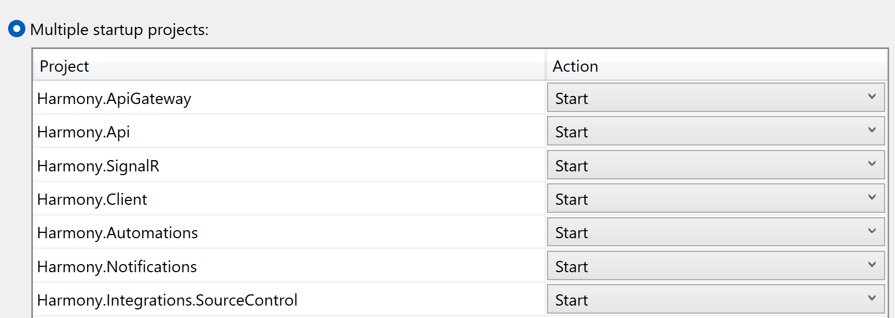

# 🏃♂ Debugging

### Running the apps through Visual Studio

In case you want to run or debug both <mark style="color:blue;">**Harmony**</mark> & <mark style="color:blue;">**Harmony.Notifications**</mark> applications from Visual Studio, set the projects as the startup projects by right clicking the solution and selecting **Configure Startup Projects..**

<figure><figcaption></figcaption></figure>

### Running the apps through command line

In order to run Harmony through command line, open a terminal and navigate at the root of the **Harmony.Server** project. Make sure you have the [dotnet runtime](https://dotnet.microsoft.com/en-us/download) or SDK installed _(currently .NET 7.0 is required but .NET 8.0 should work as well)_ and run the following command:

```
dotnet run
```

By default the app will run at [http://localhost:5181/](http://localhost:5181/). In case you want to change this change **5181** to what port you want at the **launchSettings.json** file for the http profile. The following example set the port to **5000**.

```json
      "http": {
        "commandName": "Project",
        "dotnetRunMessages": true,
        "launchBrowser": true,
        "inspectUri": "{wsProtocol}://{url.hostname}:{url.port}/_framework/debug/ws-proxy?browser={browserInspectUri}",
        "applicationUrl": "http://localhost:5000",
        "environmentVariables": {
          "ASPNETCORE_ENVIRONMENT": "Development"
        }
      },
```

Do the same for <mark style="color:blue;">**Harmony.Notifications**</mark>. The app will start by default at [http://localhost:5094/](http://localhost:5094/).
