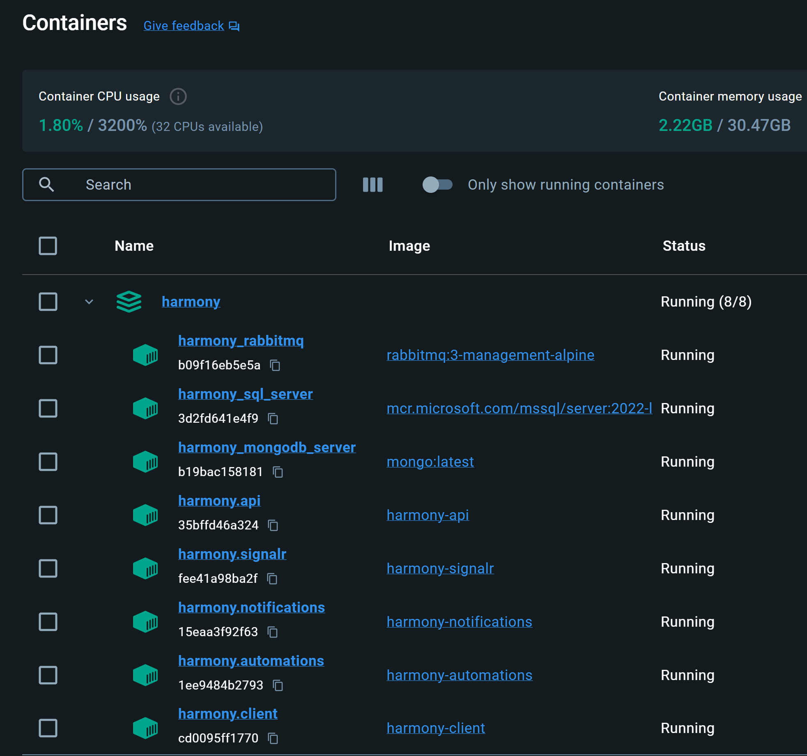

# 🐳 Docker

Harmony has adapted a clean, microservice architecture and [**docker** ](https://www.docker.com/)sits on top of this to make building and deploying the entire infrastructure with just a few commands.&#x20;

<figure><figcaption><p>Harmony containers</p></figcaption></figure>

The following instructions will guide you to build Harmony's images and run its containers on your local machine using docker compose. In case you want to deploy to a local Kubernetes cluster read the [Kubernetes](kubernetes.md) section.

#### Create and trust a development certificate

Open a PowerShell session and run the following commands to create and trust a development certificate, since all Harmony applications run under HTTPS.

```powershell
dotnet dev-certs https -ep $env:USERPROFILE\.aspnet\https\harmony.pfx -p HarmonyTeamsSecretKey
dotnet dev-certs https --trust
```

The above commands are for **Windows using Linux** containers. If you are on a **Mac** or **Linux** you need to run:

```powershell
dotnet dev-certs https -ep ${HOME}/.aspnet/https/harmony.pfx -p HarmonyTeamsSecretKey
dotnet dev-certs https --trust
```

Please read the official Microsoft's [guide](https://learn.microsoft.com/en-us/aspnet/core/security/docker-compose-https?view=aspnetcore-8.0) for more details in case you face any problems. The previous commands used a password _HarmonyTeamsSecretKey_ but you can use your own. If you do so make sure you change it on the **docker-compose.yml** file as well.

#### Build docker images and run the containers

Navigate at the root of Harmony's solution folder where the _**docker-compose.yml**_ file exists and run the following commands:

```docker
docker compose build
docker compose up
```


In case you are running Harmony via Visual Studio, make sure to stop it before running the `docker compose up` command because the same ports will be exposed by the docker containers. Also if you have MongoDB or/and RabbitMQ servers running on your local machine, you may want to stop them so they don't interfere with the ports exposed by the corresponding containers. \
\
If you don't want to stop them, you can remove the exposed ports from the **docker-compose.yml**. The ports have been exposed for your own convenience, for example if you want to access the container's RabbitMQ management UI from localhost, but they are not required.

```docker
   rabbitmq:
    image: rabbitmq:3-management-alpine
    container_name: harmony_rabbitmq
    ports:
        - 5672:5672
        - 15672:15672
```


#### Open Harmony

Assuming you have build and run all the containers properly, you can navigate at [http://localhost:7096/](http://localhost:7096/) and confirm that the page loads smoothly.&#x20;


Currently the standalone Blazor WASM project <mark style="color:blue;">Harmony.Client</mark> is served under **Nginx** via HTTP but it will change soon to HTTPS as well.


Of course, there will be more changes, improvements and additions for dockerizing Harmony in the future, e.g Kubernetes support, production overrides, etc..

#### SQL Server configuration

By default, docker will create a new SQL Server based on Microsoft's image.&#x20;

```docker
   sql_server:
    image: "mcr.microsoft.com/mssql/server:2022-latest"
    container_name: harmony_sql_server
    environment:
      - ACCEPT_EULA=y
      - SA_PASSWORD=%HarmonyTeams100
```

#### Connect to your own SQL Server outside docker

In you want to connect to your host's SQL Server rather than connecting to a docker container, check the follow steps:

1. Remove the previous snippet from the **docker-compose.yml** file and any _depends\_on_ reference to it.
2. Enable **TCP/IP** access on your SQL Server instance & restart SQL Server services.
3. Make sure your SQL Server runs under mixed mode or at least SQL Server mode so that you can connect via user & password credentials _(windows authentication won't work on a linux container!)_
4. Change the connection string in the _docker-compose.yml_ file to connect to your SQL Server. For localhost development, you must use **host.docker.internal** as the following example _(make sure you use your own credentials)_:

```
- ConnectionStrings__HarmonyJobsConnection=Server=host.docker.internal,1433;database=Harmony.Automations.Jobs;User Id=harmony_user;Password=%HarmonyTeams100;TrustServerCertificate=True
```

#### Persist SQL Server container data

In case you want to run SQL Server as a docker container but you want to persist the data and don't lose them after re-creating the container, you need to add docker volumes on the related service definition in the **docker-compose.yml**. Here's an example:

```docker
   sql_server:
    image: "mcr.microsoft.com/mssql/server:2022-latest"
    container_name: harmony_sql_server
    environment:
      - ACCEPT_EULA=y
      - SA_PASSWORD=%HarmonyTeams100
    volumes:
      - C:/HarmonySql/data:/var/opt/mssql/data
      - C:/HarmonySql/log:/var/opt/mssql/log
      - C:/HarmonySql/secrets:/var/opt/mssql/secrets
```

You can use docker managed volumes of course.
