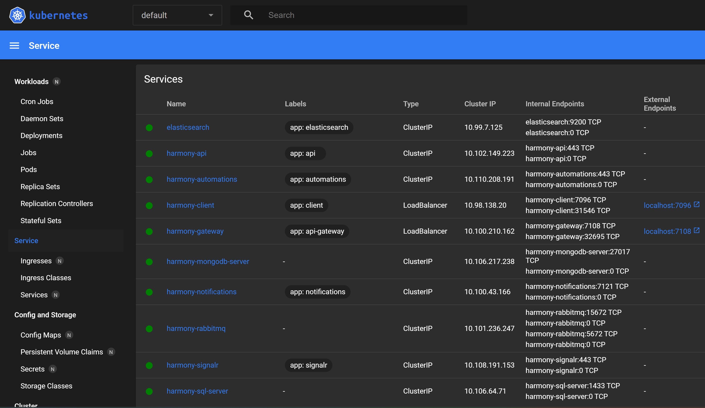

# Kubernetes

Harmony can be deployed on a [Kubernetes](https://kubernetes.io/) cluster with just a single command. The files existing in the source code are tested for a **local** Kubernetes cluster, ideally being created using the [Docker Desktop](https://www.docker.com/products/docker-desktop/) app. For production deployment, you are free to make any modifications to match your environment.

Here's the prerequisites to deploy Harmony in a local Kubernetes cluster:

* [x] You have installed and enabled **Kubernetes** on your local machine.
* [x] You have [kubectl](https://kubernetes.io/docs/tasks/tools/#kubectl) tool installed.
* [x] You have configured a development certificate as described [here](https://docs.harmony-teams.com/overview/setup/docker#create-and-trust-a-development-certificate).

#### Create a config map for the development certificate

When you configured a development certificate, a **harmony.pfx** file has been created at <mark style="color:orange;">$env:USERPROFILE\\.aspnet\https\\</mark> folder on your machine. Run the following command to create a k8s [config map](https://kubernetes.io/docs/concepts/configuration/configmap/).

```docker
kubectl create configmap cert-config-map --from-file <your-path-here>\harmony.pfx
```

Replace the _\<your-path-here>_ with your own path coming from **$env:USERPROFILE\\.aspnet\https\\**. For example:

```
kubectl create configmap cert-config-map --from-file C:\Users\chsakell\.aspnet\https\harmony.pfx
```


The config map will make sure **harmony.pfx** file will be available on your cluster.


#### Create Harmony images

Open a terminal and navigate at the root of Harmony's solution where the _docker-compose.yml_ file exists and run the following command to create the docker images:

```docker
docker compose build
```

#### Deploy pods on Kubernetes cluster

Open a terminal and navigate at the root of Harmony's solution where a **.k8s** folder exists. Run the following command to deploy harmony on your local Kubernetes:

```docker
k create -f .\.k8s\
```


The command creates all Kubernetes deployments and services existing inside the **.k8s** folder


Harmony should be up and running at [http://localhost:7096/](http://localhost:7096/)

<figure><figcaption><p>Kubernetes harmony services</p></figcaption></figure>
