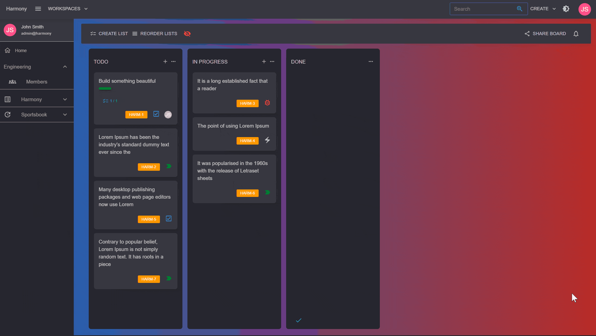
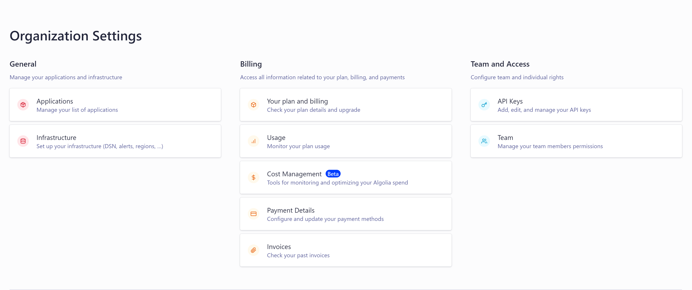
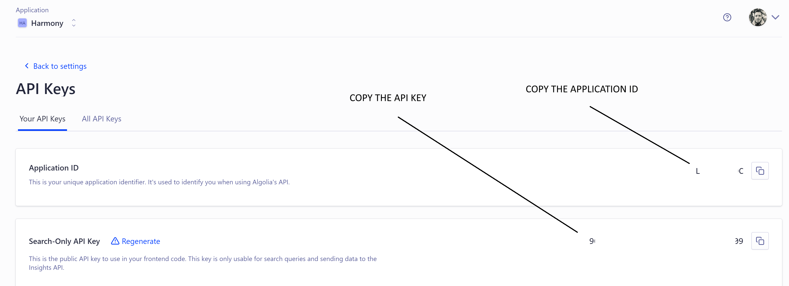

# 🔎 Search Engine

Harmony provides a powerful search engine functionality where you can search, find and edit board items in a matter of seconds. Currently there are two search engines supported:

* [Algolia](https://www.algolia.com/) search engine
* Direct database search


In case you don't want to setup **Algolia**, then you don't have to change anything. By default Harmony uses the direct database search engine.&#x20;

If though Harmony is used by many teams, having multiple boards then it is highly recommended that you integrate Algolia.


<figure><figcaption><p>Searching Harmony</p></figcaption></figure>

### Configure Algolia

Algolia is the easiest search engine existing to configure. It provides 10000 requests for free per month so you can certainly test it without even paying. Follow the next steps to create an App Id & and an API Key.&#x20;

* Subscribe and create a new account
* Navigate to your [account](https://dashboard.algolia.com/account/overview). You will see that an Application has been already created in the **Applications** nav item. If you wish you can rename it and if not created automatically for you, proceed by creating one. Make sure you copy its **ApplicationId**.

<figure><figcaption><p>Algolia account page</p></figcaption></figure>

* Click the API keys from your [account](https://dashboard.algolia.com/account/overview) page. Again, you will see that an API public key that can be used for searching has been already created for you. In case there isn't any, then create one. Copy the **API Key**.

<figure><figcaption><p>API key</p></figcaption></figure>

* Select Algolia for your search engine in the Harmony.Server project in the program.cs

```csharp
builder.Services.AddSearching(SearchEngine.Algolia, builder.Configuration);
```

* Set the **ApplicationId** and the **ApiKey** properties in the _appsettings.json_ file in the <mark style="color:blue;">Harmony.Serve</mark>r and <mark style="color:blue;">Harmony.Notifications</mark> projects.&#x20;

```json
  "AlgoliaConfiguration": {
    "ApplicationId": "YOUR_APPLICATION_ID_HERE",
    "ApiKey": "YOUR_API_KEY_HERE"
  },
```


Algolia indexing is being handled by the **Harmony.Notifications** that accepts messages from the **RabbitMQ** so make sure you have both of them up & running. \
Every time you make a change in cards, Harmony.Server sends a message and Harmony.Notifications makes a request to Algolia to update/index the change.


Algolia will contain an index for each board named by the **workspace\_name-board\_name** and it's being created when you **create the board**. This means that you may have to re-create from scratch the board/project and add cards to it. In a future release, there will be a button that automatically syncs all boards and their items without having to create it from scratch :fingers\_crossed:.
