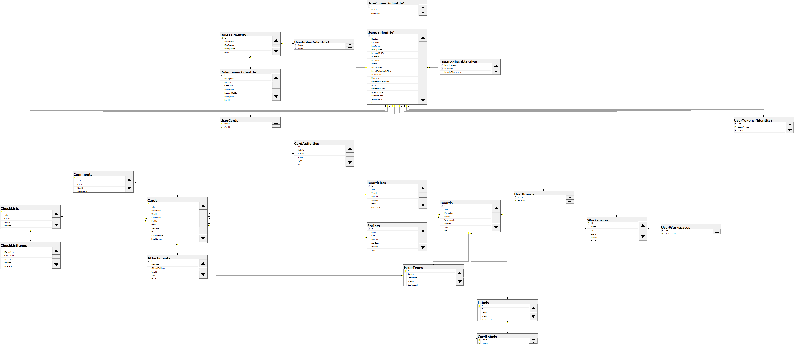

# 🔥 Technology

The stack, tools, frameworks used in Harmony are the following:

* ASP.NET CORE
* SignalR
* [Blazor](https://dotnet.microsoft.com/en-us/apps/aspnet/web-apps/blazor)
* [MudBlazor](https://mudblazor.com/) components
* Entity Framework
* Dapper
* CQRS MediatR
* [AutoMapper](https://automapper.org/)
* [HangFire](https://www.hangfire.io/)
* [RabbitMQ](https://rabbitmq.com/)
* [Algolia](https://www.algolia.com/) search engine integration _(optional)_

#### Database diagram

<figure><figcaption></figcaption></figure>

#### Read next - Configure Harmony


[setup](setup/)

