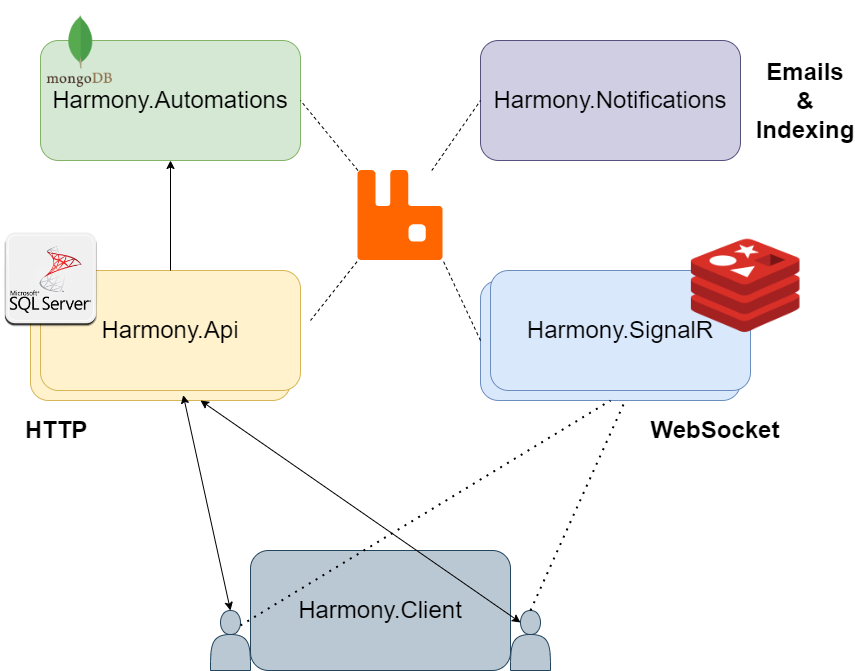

# 🔥 Technology

Harmony's **codebase** is a state of the art _(soon dockerized)_ solution, built with best practices, patterns and a clean microservice architecture. You will be impressed by how easily can be scaled and maintained on a codebase level by adding new features or on infrastructure level by scaling horizontally.&#x20;


If you are an engineer or developer, you will be certainly benefit just by studying its codebase.


The stack, tools, frameworks used in Harmony are the following:

| Databases                           | Server    | Front                                                                    |
| ----------------------------------- | --------- | ------------------------------------------------------------------------ |
| SQL Server                          | .NET Core | [Blazor](https://dotnet.microsoft.com/en-us/apps/aspnet/web-apps/blazor) |
| [MongoDB](https://www.mongodb.com/) | SignalR   | [MudBlazor](https://mudblazor.com/)                                      |
| Redis                               |           |                                                                          |

| Data Access      | Patterns           | Messaging                         |
| ---------------- | ------------------ | --------------------------------- |
| Entity Framework | Clean architecture | [RabbitMQ](https://rabbitmq.com/) |
| Dapper           | CQRS MediatR       |                                   |
|                  |                    |                                   |

<figure><figcaption></figcaption></figure>

#### Database diagram

<figure><figcaption></figcaption></figure>

#### Read next - Configure Harmony


[setup](setup/)

